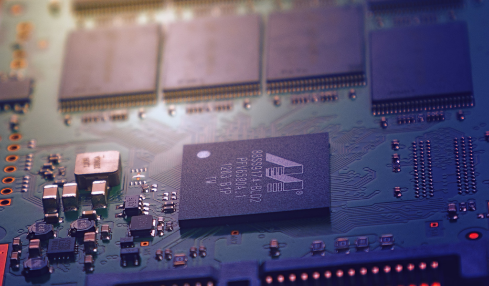

En este [link](https://la35.github.io/emulador) pueden encontrar un emulador de TOY-8, una computadora super simple pero que ilustra perfectamente como una CPU ejecuta un programa desde la memoria. Todo el crédito de esta computadora es para Robert Sedgewick y Kevin Wayne, autores de [Computer Science: An Interdisciplinary Approach](https://www.amazon.com/Computer-Science-Interdisciplinary-Robert-Sedgewick/dp/0134076427/ref=sr_1_1?dchild=1&keywords=computer+science&qid=1592843578&s=books&sr=1-1), el manual de donde saqué esta computadora ficticia.

El emulador está re crudo todavía, hay bastante para mejorar pero funciona. También les dejo un [circuito para el Logisim](../assets/files/toy8.circ) de la computadora.

## La arquitectura

TOY-8 es una computadora con lo mínimo indispensable:

- Una memoria de 16 bytes, de los cuales solo 14 bytes están disponibles para el programador (de la dirección 1 a la 14). Las direcciones 0 y 15 están reservadas. La dirección de memoria cero siempre vale cero.
- Una CPU con un registro de propósito general (R) y una ALU con tres operaciones (suma, and y xor).
- Una sistema de E/S en binario al que se accede por medio de la dirección 15 de la memoria.

El lenguaje máquina de TOY-8 tiene ocho instrucciones que se codifican usando los primeros 4 bits (0-3) para indicar una dirección de memoria y los últimos 3 bits (5-7) para indicar el _opcode_ (código de operación). Los bits están numerados de derecha a izquierda, el cuarto bit no se usa y decimos que siempre es cero.

```
campos:  opcode|x|address
            101|0|0000
  bits:     7   4    0
```
La instrucción de arriba corresponde a un `load word 0` o `lw 0` en algo similar a un lenguaje ensamblador. Lo que hace esa instrucción es cargar el contenido de la dirección de memoria cero en el registro R. Eso mismo escrito en pseudocódigo sería `R = M[0]` o lo que es lo mismo `R = 0` porque la dirección de memoria cero siempre vale cero. La instrucción de arriba, que en lenguaje máquina es `10100000` (en binario) es mucho más fácil de leer en hexadecimal: `A0`.

Las ocho instrucciones de TOY-8 se resumen en la siguiente tabla.

|Opcode (bin)|Opcode (hex)|Assembler|Pseudocódigo           |
|:----------:|:----------:|:-------:|:---------------------:|
|0000        |0           |`halt`   |                       |
|0010        |2           |`add`    |`R = R + M[addr]`      |
|0100        |4           |`and`    |`R = R & M[addr]`      |
|0110        |6           |`xor`    |`R = R ^ M[addr]`      |
|1000        |8           |`la`     |`R = addr`             |
|1010        |A           |`lw`     |`R = M[addr]`          |
|1100        |C           |`sw`     |`M[addr] = R`          |
|1110        |E           |`bze`    |`if (r == 0) PC = addr`|


Las instrucciones en _assembler_ significan:

- `halt` para la CPU.
- `add`, `and` y `xor` las operaciones de la ALU, suma aritmética y AND y XOR bit a bit.
- `la` _load address_ (cargar dirección).
- `lw` _load word_ (cargar palabra).
- `sw` _store word_ (guardar palabra).
- `bze` _branch if zero_ (ramificar si R es cero).

## La microarquitectura

Para implementar estas ocho instrucciones no necesitamos demasiado, ese es el punto justamente de esta computadora. Tenemos 5 elementos dentro de la CPU:

- El _datapath_ (camino de datos):
  - La ALU
  - Registros:
    - PC (contador de programa)
    - IR (registro de instrucción)
    - R (acumulador)
- La unidad de control

También son necesarios algunos multiplexores dentro de la CPU para enrutar algunas entradas que tienen más de un origen posible.

Fuera o dentro de la CPU, marcando el ritmo de la unidad de control tenemos un reloj. El ciclo de instrucción de esta computadora es simple:

1. Señal de reloj baja, fase de _fetch_, traigo la próxima instrucción de memoria y la guardo en IR. Incremento el PC.
2. Señal de reloj alta, fase de ejecutar la instrucción y realizar cambios en R o la memoria.
3. Repetir.

Todas las instrucciones ocupan un solo ciclo de reloj. Dejo fuera de la siguiente discusión el sistema de E/S. La arquitectura de TOY-8 especifica que la dirección de memoria 0xF (15) está mapeada a la E/S y basta con escribir o leer de esta dirección de memoria para leer de o imprimir datos a un periférico, un byte a la vez.

### El datapath

La ALU opera sobre números de 8 bits. Tiene dos entradas A y B, la primera conectada a R y la segunda a la memoria. El resultado de la operación entre A y B es su única salida y va conectada a R. Cuando tenemos este tipo de esquema con un solo registro de propósito general en la CPU decimos que tenemos una arquitectura de acumulador. El acumulador sería el registro R.



Los otros dos registros son el contador de programa que indica la dirección de la próxima instrucción del programa, y el registro IR (_instruction register_) que guarda la instrucción que se está ejecutando para que la unidad de control la decodifique y ejecute. Parte de IR va conectado al bus de direcciones para indicar direcciones de memoria y los últimos 3 bits (contando de izquierda a derecha) van conectados a la unidad de control ya que indican el _opcode_. El PC va conectado también al bus de direcciones durante la fase de _fetch_. Un multiplexor elige el valor correcto para el bus de direcciones de IR o del PC según la fase del ciclo de instrucción.

El otro multiplexor de la CPU está ubicado antes de la entrada de R, porque hay tres fuentes posibles para R: la ALU, IR (en `load address`) y la memoria (en `load word`).

### Control

La unidad de control tiene tres entradas y ocho salidas.

- Entradas:
  - Reloj: para delimitar las dos fases del ciclo de instrucción.
  - IR: los tres bits del _opcode_.
  - R: los 8 bits con el valor almacenado en R para la instrucción `bze`.
- Salidas:
  - Una señal de dos bits para indicarle a la ALU que operación realizar.
  - Dos señales que controlan los dos multiplexores del _datapath_.
  - Cuatro señales para indicarles a los elementos de memoria cuando deben almacenar un dato nuevo (para PC, R, IR y la memoria).
  - Una señal que indica que se llegó a una instrucción de `halt` que se usa para parar el reloj y toda la computadora.

La entrada de tres bits del _opcode_ va conectada internamente a un decodificador 3:8 y sumado a la entrada de reloj formando un demultiplexor se activan las señales correctas en las dos fases del ciclo de instrucción. La unidad de control es un circuito combinacional.

### Cómo funciona

Veamos un ejemplo, tenemos el siguiente programa que suma los números en `M[5]` y `M[6]` y pone el resultado en `M[7]`. La primer instrucción está en `M[1]` Entre paréntesis traduzco a ensamblador.

```
a5 (lw 5)
26 (add 6)
c7 (sw 7)
00 (halt)
03 (dato)
02 (dato)
00 (dato)
```

1. Cuando prendemos la computadora el PC vale 1 así que la unidad de control activa IR y guarda `a5` en ese registro.
2. El reloj ahora vale 1 y la instrucción en IR (el _opcode_) va hacia la unidad de control.
3. La unidad de control habilita R y pone la dirección 5 en el bus de direcciones, el contenido de `M[5]` se guarda en R.
4. Vuelve a comenzar el ciclo de instrucción, ahora guardamos `26` en IR.
5. Decodificamos y ejecutamos lo que está en IR. Es un `add 6`, por lo tanto la unidad de control indica a la ALU que realice una suma con lo que está en R y en `M[6]`. El resultado se guarda en R.
6. Volvemos a la fase de _fetch_, ahora guardamos `C7` en IR.
7. Se trata de un `sw 7`, la unidad de control indica a la memoria que guarde el dato que se encuentra en R en la dirección de memoria 7.
8. Volvemos a comenzar, esta vez guardamos `00` en IR.
9. Es un `halt`, la unidad de control enciende la señal que frena el reloj y la CPU se detiene. Si examinamos la memoria tenemos un 5 en la dirección de memoria 7 como es de esperarse.

## Un programa

Les dejo un programa para que prueben en la computadora en el Logisim, recuerden que el código arranca en la dirección de memoria 0x1, porque la 0x0 siempre vale cero por diseño.

```
a0
ce
af
e9
2e
ce
a0
e3
ae
cf
00
```     

El programa suma los números en la entrada estándar hasta que se ingrese un cero. Luego muestra la suma en la salida.
