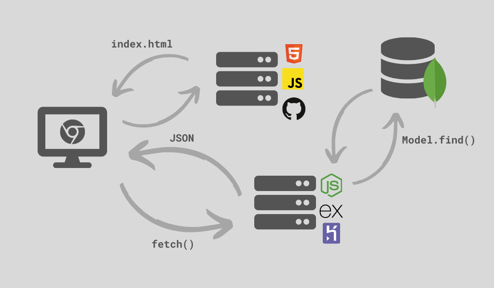

Cómo usar `fetch()` para consumir una API. Todo el código y esta misma guía la pueden ver directamente en el [repo](https://github.com/santiagotrini/hello-fetch).

## Qué vamos a hacer

Vamos a armar una interfaz de usuario bien inútil pero que demuestre como usar `fetch()` para consumir la API de la guía anterior. Vamos a tener una tabla con los datos de la colección `users` de nuestra base de datos. Y también vamos a tener un campo de texto y un botón para buscar usuarios por ID y mostrarlos en la tabla.



Una breve explicación antes de arrancar. La aplicación completa funciona de la siguiente manera:

1. El cliente realiza una petición HTTP a GitHub Pages, algo así como `GET / http://user.github.io/hello-fetch`
2. El server de GitHub le responde al navegador con `index.html`. Linkeado al HTML viene también `script.js`.
3. Apenas el navegador termina de cargar el documento HTML, el código en `script.js` realiza una petición HTTP a nuestro _backend_ en Heroku. Algo así como `GET /api/users http://hellodb.herokuapp.com`. Usamos `fetch()` para hacer esta petición.
4. La API que hicimos en Express hace una _query_ a la base de datos en MongoDB Atlas.
5. El servidor de Mongo le responde al _backend_ con una lista de documentos, o en JS, un array de objetos.
6. El _backend_ convierte ese array a formato JSON y lo envía al navegador.
7. El código en `script.js` convierte nuevamente el JSON a objetos de JS y manipula la interfaz de usuario para mostrar la información.

## Antes de empezar

Necesitamos nuestro _backend_ ya funcionando en Heroku, el de la guía anterior. El mío está en https://hello-database.herokuapp.com/api/. El _frontend_ lo vamos a hacer con HTML y JS. Para darle un poco de onda vamos a usar Bootstrap que es un _framework_ de CSS muy famoso hecho por la gente de Twitter. El sitio va a estar hosteado directamente desde el repo de GitHub con GitHub Pages.

## Creando el proyecto

Esto ya lo hicimos en [hello-gh-pages](https://github.com/santiagotrini/hello-gh-pages).

```console
$ mkdir hello-fetch
$ cd hello-fetch
$ git init
$ touch index.html
$ mkdir js
$ cd js
$ touch script.js
```

Para este proyecto no necesitamos NodeJS. Abrimos el directorio `hello-fetch` en nuestro editor de texto y nos vamos a ver el código.

Para ir viendo el resultado simplemente abrimos `index.html` en nuestro navegador web preferido.

## Creamos una interfaz de usuario con HTML y Bootstrap

En `index.html` agregamos los elementos de nuestra interfaz en el `body`. Además linkeamos el CSS de Bootstrap.

Todo lo que va en `body` va adentro de un `div` con `id="container"` y `class="container"`. Esto es para marcarle a Bootstrap el contenido de nuestro sitio.

También le damos IDs a distintos elementos del sitio para poder modificarlos después con JavaScript. Precisamente a `input`, `table`, `tbody` y el `h3`.

```html
<!DOCTYPE html>
<html lang="es" dir="ltr">
  <head>
    <meta charset="utf-8">
    <meta name="viewport" content="width=device-width, initial-scale=1, shrink-to-fit=no">

    <!-- CSS de Bootstrap -->
    <link rel="stylesheet" href="https://stackpath.bootstrapcdn.com/bootstrap/4.1.3/css/bootstrap.min.css">

    <title>Hello fetch</title>
  </head>
  <body>
    <div id="container" class="container">
      <h1>Hello fetch</h1>
      <p>Ingresá el ID del usuario que querés buscar.</p>
      <input id="userID" placeholder="ID" type="text">
      <button>Buscar</button>
      <hr>
      <table id="table">
        <thead>
          <th>id</th>
          <th>Nombre</th>
          <th>Email</th>
          <th>Cumpleaños</th>
          <th>Edad</th>
        </thead>
        <tbody id="tbody"></tbody>
      </table>
      <h3 id="nores"></h3>
    </div>
    <script type="text/javascript" src="js/script.js"></script>
  </body>
</html>
```

No se olviden del `<script>` antes del cierre del `<body>` que es donde linkeamos el código de JS que va a modificar y actualizar la interfaz. Toda la lógica de la UI va a estar en el archivo `script.js`.

## Agregamos clases de Bootstrap

Para darle estilo a los elementos en vez de escribir CSS nosotros vamos a usar los estilos que vienen con Bootstrap. Para aplicar estilos hay que agregar clases a los elementos en el HTML. Vamos en orden desde arriba.

Primero para despegar un poco el contenido del sitio del margen superior de la ventana agregamos la clase `mt-3` al `div` con clase `container`.

```html
<body>
  <div id="container" class="container mt-3">
    <h1>Hello fetch</h1>
```

Ahora el input y el botón. Vamos a usar algunos divs para poder acomodarlos mejor. Usamos algunas clases del sistema de grilla de Bootstrap como `row` o `col-xs-2` en los divs. La clase `form-control` es la que le da el estilo básico de Bootstrap a los elementos de formularios. Las clases `btn` y `btn-primary` son para darle la apariencia típica de Bootstrap a los botones. Además agregamos el atributo `onclick` al botón para indicarle qué función de JS ejecutar. Ya la vamos a definir después en `js/script.js`.

```html
<div class="form-group row">
  <div class="col-xs-2 mx-2">
    <input id="userID" placeholder="ID" class="form-control" type="text">
  </div>
  <div class="col-xs-3 mx-1">
    <button class="btn btn-primary" onclick="fetchUser()">Buscar</button>
  </div>
</div>
```

La tabla es más fácil. Agregamos las clases `table` y `table-striped` al elemento `<table>` y la clase `thead-dark` al `<thead>`.

```html
<hr>
<table id="table" class="table table-striped">
  <thead class="thead-dark">
```

Con eso ya estamos listos para ver el código de JS. Más información sobre las clases y lo que podemos hacer con Bootstrap en la [documentación](https://getbootstrap.com/docs/4.5/getting-started/introduction/).

## Actualizar la UI con JavaScript

Nos vamos a `js/script.js` y copiamos el siguiente código.

```js
// cuando termine de cargar el documento poblamos la tabla
document.addEventListener("DOMContentLoaded", function() {
  fetchData();
});

// esta funcion carga la tabla apenas carga la pagina
// fetch() es el método nativo de los navegadores para hacer peticiones AJAX
// se usa con promesas ya que es asíncrono
function fetchData() {
  fetch('https://hello-database.herokuapp.com/api/users')
    .then(res => res.json())
    .then(users => {
      populateTable(users);
    });
}

// esta funcion carga los usuarios en la tabla
// crea una fila en la tabla por cada elemento en el array users
function populateTable(users) {
  for (let user of users) {
    // borramos las propiedades que no queremos en la tabla
    delete user._id;
    delete user.__v;
    // agregamos la edad para la ultima columna
    let now = new Date();
    user.age = now.getFullYear() - new Date(user.birthday).getFullYear();
    // formateamos la fecha de cumpleaños
    let birthday = new Date(user.birthday);
    user.birthday = birthday.toLocaleDateString('es-AR');
    // creamos una fila
    let row  = document.createElement('tr');
    for (let key in user) {
      // agregamos una columna por cada propiedad
      let col = document.createElement('td');
      col.innerHTML = user[key];
      row.append(col);
    }
    // agregamos la fila al tbody y repetimos
    document.getElementById('tbody').append(row);
  }
}

// esta funcion carga un solo usuario en la tabla
function fetchUser() {
  let id = document.getElementById('userID').value;
  // si el id no es un numero terminamos
  if (isNaN(id)) return;
  fetch(`https://hello-database.herokuapp.com/api/user/${id}`)
    .then(res => res.json())
    .then(user => {
      let users = [user];  // populateTable usa un array de objetos como argumento
      // si tenemos un usuario lo cargamos en la tabla
      if (users[0] !== null) {
        // reemplazamos el tbody por uno nuevo con el usuario que encontramos
        let oldTBody = document.getElementById('tbody');
        let newTBody = document.createElement('tbody');
        newTBody.id = 'tbody';
        oldTBody.replaceWith(newTBody);
        // cargamos la fila
        populateTable(users);
        // actualizamos la UI
        document.getElementById('table').hidden = false;
        document.getElementById('nores').innerHTML = '';
      } else {
        // si no hay usuario con ese ID mostramos un mensaje
        document.getElementById('table').hidden = true;
        document.getElementById('nores').innerHTML = 'No hay resultados';
      }
    });
}
```

Los comentarios del código explican brevemente cada parte. Las primeras dos líneas están para que la función `fetchData()` se ejecute apenas el navegador termine de leer el HTML, osea cuando el documento `index.html` termine de cargarse. La idea es que le decimos en el script que cuando se dispare el evento `DOMContentLoaded` se ejecute esa función.

Las funciones que aparecen en el script son tres.

- `fetchData()`: le pide a la API el array con todos los usuarios y llama a `populateTable()`.
- `populateTable()`: con un array de objetos que representan usuarios arma las filas de la tabla.
- `fetchUser()`: le pide a la API el objeto que representa al usuario con el ID que aparece en el campo de texto. Reemplaza la tabla con la fila que corresponde a ese usuario o muestra un mensaje si el ID no existe en la base de datos.

Las funciones `fetchData()` y `fetchUser()` son las que utilizan la API, la primera con la ruta https://hello-database.herokuapp.com/api/users y la segunda con https://hello-database.herokuapp.com/api/user/id. Reemplacen por supuesto las URLs por las de su API que crearon en la guía anterior.

En lo que respecta a la manipulación del HTML los métodos más interesantes son:

- `document.getElementById()` para obtener un elemento del documento en base a su id.
- `document.createElement()` para crear un elemento de HTML nuevo.
- `node.append()` donde `node` es algún elemento que ya está en la página al que le queremos agregar un nuevo elemento.
- `node.replaceWith()` para reemplazar un elemento por otro.

## Pusheamos a GitHub Pages

Listo, proyecto terminado. Para verlo online creamos un repo nuevo en GitHub y pusheamos.

```console
$ git add .
$ git commit -m "algun mensaje"
$ git remote add origin https://github.com/usuario/hello-fetch.git
$ git push -u origin master
```

Y en el repo en la pestaña de _settings_ le damos a publicar en GitHub Pages desde la rama _master_ como hicimos en [hello-gh-pages](https://github.com/santiagotrini/hello-gh-pages).

## Guías, referencias y documentación

Para los más curiosos les dejo algunos links.

- La documentación oficial de Bootstrap [aquí](https://getbootstrap.com/docs/4.5/getting-started/introduction/) (en inglés).
- Un [artículo](https://developer.mozilla.org/es/docs/Web/API/Fetch_API/Utilizando_Fetch) en MDN sobre el uso de Fetch.
- Modificando el documento en JS, sacado de una de las [mejores referencias online de JS](https://javascript.info/modifying-document) (en inglés).
