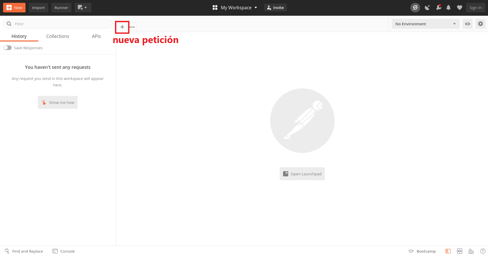
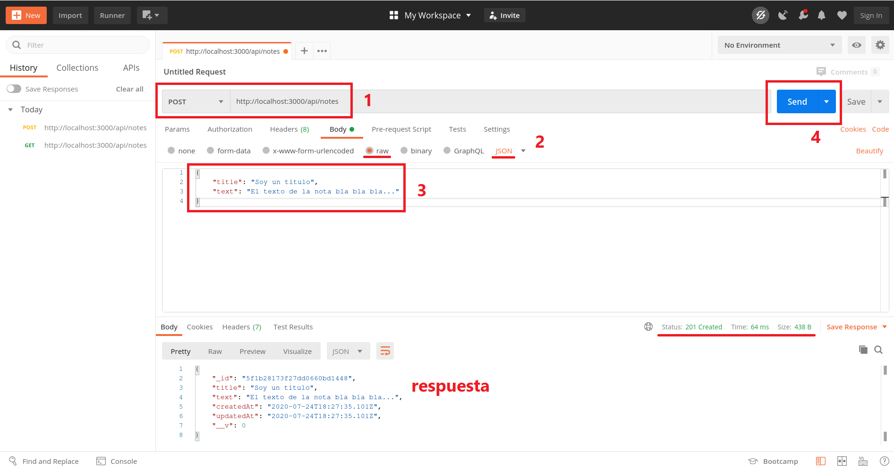
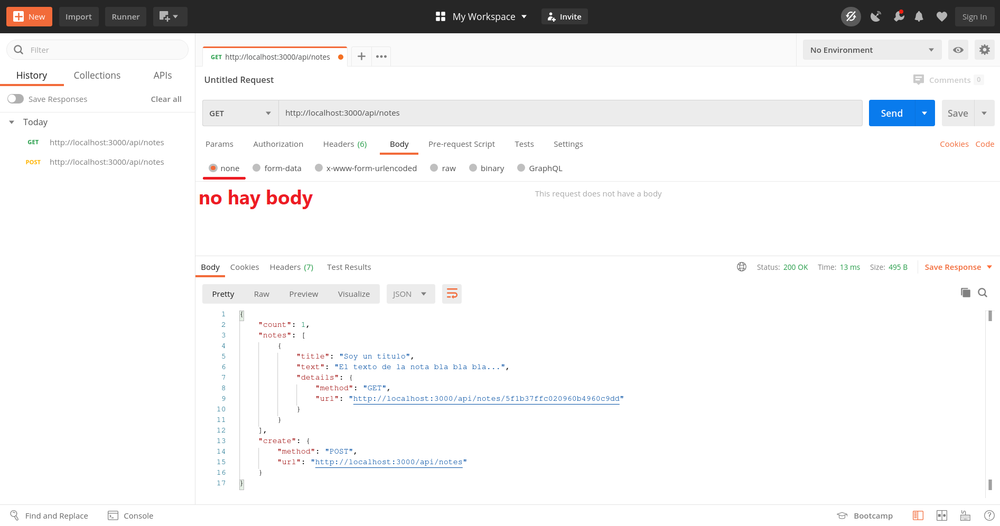
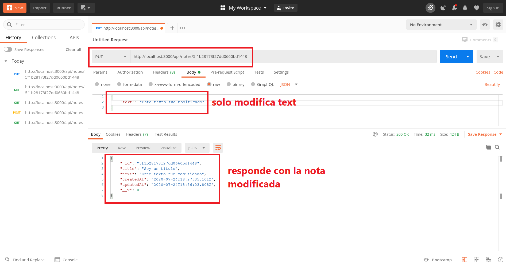
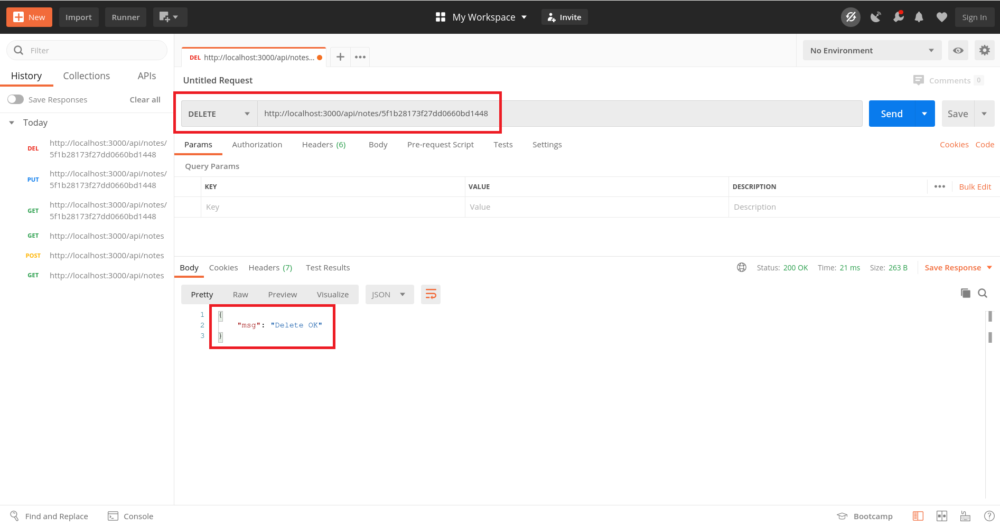

Una API REST en Express y Mongoose para una app de tomar notas. Todo el código disponible en [GitHub](https://github.com/santiagotrini/hello-crud).

## Qué vamos a hacer

Vamos a a hacer una API con las cuatro operaciones básicas sobre una colección de MongoDB. El acrónimo CRUD viene del inglés _create, read, update, delete_ (crear, leer, actualizar y borrar). Para eso vamos a usar los métodos que Mongoose nos da para los modelos.

La base de datos va a guardar notas y en la próxima guía vamos a armar un _frontend_ en React para una aplicación de tomar notas que use esta API.
La API tiene que devolver JSON siempre, incluso en caso de error.

Vamos a explorar el concepto de HATEOAS (_hypermedia as the engine of application state_) que es propio de la arquitectura REST. Este principio consiste en que las respuestas de la API contienen links que el cliente puede seguir para continuar la interacción con el servidor.

Además vamos a usar Postman para testear manualmente los _endpoints_ con los distintos métodos HTTP.

## Creando el proyecto

Creamos el proyecto en la terminal.

```console
$ mkdir hello-crud
$ cd hello-crud
$ npm init -y
$ git init
$ touch index.js
$ mkdir api
$ mkdir api/routes api/models
$ touch api/routes/note.js
$ touch api/models/Note.js
$ npm i express mongoose cors morgan
$ npm i -D nodemon
$ echo node_modules > .gitignore
$ echo web: npm start > Procfile
```

Agregamos los scripts `dev` y `start` al `package.json`.

```json
"scripts": {
  "start": "node index.js",
  "dev": "nodemon index.js"
}
```

Vamos a necesitar después una base de datos en MongoDB Atlas y nuestro código en algún repo de GitHub. Esta API la podemos hostear en Heroku como hicimos con [hello-database](https://github.com/santiagotrini/hello-database).

Todo el código relativo a la API lo vamos a poner en el directorio `api`. Más adelante vamos a usar este mismo proyecto para el _deploy_ de nuestro _frontend_.

## El server

El esqueleto básico de Express que ya conocemos va en `index.js`.

```js
const express  = require('express');
const mongoose = require('mongoose');
const cors     = require('cors');
const morgan   = require('morgan');

// config vars
const port = process.env.PORT        || 3000;
const db   = process.env.MONGODB_URI || 'mongodb://localhost/notas';

// crear app
const app = express();

// conexion a la base de datos
mongoose.set('useUnifiedTopology', true);
mongoose.set('useFindAndModify', false);
mongoose
  .connect(db, { useNewUrlParser: true })
  .then(() => {
    console.log(`DB connected @ ${db}`);
  })
  .catch(err => console.error(`Connection error ${err}`));

// todo el middleware aca abajo y antes del listen

// listen
app.listen(port, () => {
  console.log(`Server listening on port ${port}`)
});  
```

Entre la conexión a Mongo y el `app.listen()` vamos a poner todos los _middlewares_ de Express. Vamos uno por uno.

Primero agregamos los _middlewares_ de las librerías que instalamos. Y luego linkeamos las rutas de la API que vamos a definir en el archivo `api/routes/note.js`.

```js
app.use(express.json());
app.use(cors());
app.use(morgan('dev'));
app.use('/api', require('./api/routes/note'));
```

Los dos _middlewares_ del medio no requiren mucha explicación, ya los usamos. CORS para evitar errores por SOP y Morgan para loggear mientras desarrollamos. Es recomendable sacar Morgan cuando llevamos la app a producción (cuando la ponemos a funcionar para los usuarios).

El primero merece una explicación. Cuando tengamos que crear o actualizar notas en la base de datos vamos a tener que pasar datos del cliente al servidor. Esos datos van a viajar en el cuerpo (_body_) de la petición HTTP en formato JSON. Para poder capturar ese JSON y verlo en `req.body` necesitamos `express.json()`, un _middleware_ incluído en Express.

La cuarta línea es nuestro archivo de rutas y nos va a generar un error porque todavía no hace nada. Vamos al código de `note.js` entonces.

## Definiendo los endpoints de la API

Un _endpoint_ es una URL y un método HTTP. Una de las ideas detrás de una API REST es hacer corresponder una URL con un recurso y un método HTTP con una operación.

Por recurso entendemos acá una colección en MongoDB, aunque podría ser otra cosa. En nuestro caso tenemos una sola colección, `notes` (notas).

Y por operación nos referimos a las operaciones CRUD. Hacemos corresponder los métodos HTTP de la siguiente manera:

- `POST`: crear (_create_)
- `GET`: leer (_read_)
- `PUT`: modificar (_update_)
- `DELETE`: eliminar (_delete_)

En total vamos a tener cinco _endpoints_ o rutas.

- `POST /notes`: crea una nota
- `GET /notes`: consulta todas las notas
- `GET /notes/id`: consulta una nota filtrando por ID
- `PUT /notes/id`: modifica una nota filtrando por ID
- `DELETE /notes/id`: elimina una nota filtrando por ID

Entonces `api/routes/note.js` viene a ser algo así.

```js
const express = require('express');
const router = express.Router();

const Note = require('../models/Note');

// POST /notes
router.post('/notes', (req, res, next) => {
  // ...
});
// GET /notes
router.get('/notes', (req, res, next) => {
  // ...
});
// GET /notes/id
router.get('/notes/:id', (req, res, next) => {
  // ...
});
// PUT /notes/id
router.put('/notes/:id', (req, res, next) => {
  // ...
});
// DELETE /notes/id
router.delete('/notes/:id', (req, res, next) => {
  // ...
});

module.exports = router;
```

Claro que no podemos hacer mucho en esas funciones hasta que no tengamos un modelo para trabajar con la base de datos.

## Modelo de nota

En la base de datos cada nota va a estar representada en un objeto similar a este.

```js
{
  _id: '5f1914483a78a51b1d3d69b1',
  title: 'Titulo de la nota',
  text: 'Texto de la nota',
  updatedAt: '2020-07-23T04:38:32.669Z',
  createdAt: '2020-07-23T04:38:32.669Z'
}
```

Donde los campos `updatedAt` y `createdAt` son _timestamps_ o fechas que indican el tiempo de creación y la última modificación y el campo `_id` es el identificador único generado por MongoDB. Vamos a darles valores por defecto a los dos últimos campos y hacer que el título y el texto sean obligatorios. El ID se va a generar automáticamente. El archivo `api/models/Note.js` es sencillo.

```js
const mongoose = require('mongoose');

const NoteSchema = new mongoose.Schema({
  title: { type: String, required: true },
  text: { type: String, required: true },
  createdAt: { type: Date, default: Date.now },
  updatedAt: { type: Date, default: Date.now }
});

const Note = mongoose.model('Note', NoteSchema);

module.exports = Note;
```

Ahora sí podemos volver a las rutas, pero antes pensemos que pasaría si los clientes de esta API no la usan de la manera debida.

## Manejo de errores

El manejo de errores o _error handling_ como le dicen en inglés es una buena parte del trabajo de los desarrolladores. Uno tiene que pensar mal del usuario, el usuario rompe las cosas y las usa de maneras no anticipadas por el desarrollador.

Por ejemplo, a esta altura sabemos que rutas tienen sentido para esta app, pero en la barra de direcciones del navegador uno puede escribir lo que quiera, como `http://host.com/api/autos` o `http://host.com/ruta/secreta`.

Si esto va a ser una API REST más o menos seria tiene que comportarse como tal, si la ruta existe seguro va a devolver algo en JSON, pero si no existe también queremos que devuelva JSON, posiblemente indicando el error. Volvamos a `index.js` a ver que podemos hacer.

```js
// index.js

// middlewares (antes del listen)
// los middlewares se ejecutan en orden para todas las peticiones
// salvo que no coincida la ruta
// (solo para el 4to middleware en este caso)  
app.use(express.json());                        // 1er middleware
app.use(cors());                                // 2do middleware
app.use(morgan('dev'));                         // 3er middleware
app.use('/api', require('./api/routes/note'));  // 4to middleware
// si el cliente NO hace una peticion a algun endpoint de la API
// entonces usamos una ruta que devuelva un status code 404
// 5to middleware (error 404 not found)
app.use((req, res, next) => {
  const err = new Error('Not found');
  err.status = 404;
  next(err);
});
// no terminamos la cadena de middlewares ahi
// la pasamos a un 6to middleware que responda al cliente
// con el error 404 o 500 si vino de otro lado el problema
app.use((err, req, res, next) => {
  res.status(err.status || 500);
  // para mas detalles usar: console.error(err.stack)
  res.json({ error: err.message });
});
```

El quinto _middleware_ se ejecuta cuando escribimos una ruta que no definimos en la API, genera un error y se lo pasa al sexto _middleware_ que devuelve el error en formato JSON. Si el error no era un 404 y vino de otro lado toma el código 500 que significa _Internal Server Error_ y lo envía al cliente.

El truco más importante acá es que el server responda a cualquier ruta con 404 salvo que antes haya pasado por las rutas puntuales de la API. Nos valemos de que el orden de los _middlewares_ va a ser el orden en el que aparecen en el código.

## Implementando los endpoints

Ahora sí volvemos a `api/routes/note.js` y escribimos el código para cada _endpoint_. Conviene instalar una app como [Postman](https://postman.com) para testear manualmente que todo funcione. Las peticiones con método `GET` las podemos hacer desde el navegador web, pero para `POST`, `PUT` y `DELETE` necesitamos otra herramienta. Postman sirve para eso, una alternativa en la terminal sería usar [cURL](https://es.wikipedia.org/wiki/CURL).

### POST /notes

La API tiene que crear una nueva nota en la base de datos cuando recibe una petición de tipo `POST` a `/api/notes`. En el cuerpo de la petición tienen que estar el título y el texto de la nota en formato JSON, como en el siguiente ejemplo.

```json
{
  "title": "Un titulo",
  "text": "Esta nota tiene texto"
}
```

Esos datos van a estar en `req.body.title` y `req.body.text` gracias a `express.json()`. El código de este _endpoint_ es el que sigue.

```js
router.post('/notes', (req, res, next) => {
  const note = new Note({
    title: req.body.title,
    text: req.body.text
  });
  note.save((err, note) => {
    if (err) return next(err);
    res.status(201).json(note);
  });
});
```

Creamos una nueva instancia del modelo `Note` con `new Note()`. Los datos que no completamos toman su valor automáticamente: `_id`, `createdAt` y `updatedAt`.
Los modelos en Mongoose pueden usar la función `Model.save()` para guardarse en la base de datos, el argumento de la función es una _callback_ que se ejecuta al completar la operación de guardado. Respondemos al cliente con código 201 (_Created_) y con la nota recién creada en la respuesta. Si hay algún error lo pasamos al próximo _middleware_ que se va a encargar de manejar los errores.

### GET /notes

Una _request_ de tipo `GET` a `/api/notes` devuelve un array con todas las notas, indicando título y texto de la nota y un link para más detalles de esa nota particular. Además devuelve la cantidad de notas en el array y el link y método para crear una nueva nota. Esto es un ejemplo del principio HATEOAS que mencionamos al inicio de esta guía.

```js
router.get('/notes', (req, res, next) => {
  Note.find()                  // todos los docs de notes
    .select('_id title text')  // como SELECT en SQL
    .sort('-updatedAt')        // ordena por modificacion descendente
    .exec((err, notes) => {
      if (err) return next(err);
      // modifico un poco el resultado antes de mandarlo
      notes = notes.map(note => ({
        title: note.title,
        text: note.text,
        details: {
          method: 'GET',
          url: `${req.protocol}://${req.hostname}:3000/api/notes/${note._id}`
        }
      }));
      res.status(200).json({
        count: notes.length,   // la cantidad de elementos en notes
        notes: notes,
        create: {              // como crear una nota
          method: 'POST',
          url: `${req.protocol}://${req.hostname}:3000/api/notes`
        }
      });
    });
});
```

Algunas cosas nuevas que aparecen acá. Ordenamos el resultado de la _query_ con `sort()` para tener las notas ordenadas por fecha de actualización. Usamos `select()` para traer solo los campos que nos interesan mostrar.

Como el resultado de la _query_ esta en el array `notes` y para cada nota queremos mostrar el link al _endpoint_ con más detalles de cada nota, tenemos que modificar ese array. La manera más simple es usando el método `map()` de arrays que lleva como argumento una función. La función se ejecuta para cada elemento del array, y al terminar devuelve el array modificado. Si se les dificulta entender el funcionamiento de `Array.map()` prueben lo siguiente en la consola del navegador.

```js
let numeros = [1, 2, 3, 4];
numeros = numeros.map(n => n * 2);
console.log(numeros);
```

### GET /notes/id

Cuando mandamos una petición `GET` a `http://host/api/notes/5f1914483a78a51b1d3d69b1` o algún ID similar obtenemos todos los campos de esa nota. Además tenemos un objeto `links` en la respuesta que nos indica las operaciones disponibles para esa nota: modificarla y eliminarla.

```js
router.get('/notes/:id', (req, res, next) => {
  Note.findById(req.params.id)
    .select('_id title text createdAt updatedAt')  // todo menos __v
    .exec((err, note) => {
      if (err) return next(err);
      if (!note) return res.status(404).json({ msg: 'Not found' });
      res.status(200).json({
        note: note,
        links: {
          update: {
            method: 'PUT',
            url: `${req.protocol}://${req.hostname}:3000/api/notes/${note._id}`
          },
          delete: {
            method: 'DELETE',
            url: `${req.protocol}://${req.hostname}:3000/api/notes/${note._id}`
          }
        }
      });
    });
});
```

Pero hay dos cosas que podrían salir mal, o que el ID que ponemos en la ruta no existe, pero es válido para Mongoose, en ese caso el error es un 404 porque no hay nota con ese ID. De eso se encarga el `if (!note)`.

La otra opción es que el ID de la ruta no sea válido (no puede ser cualquier cosa). En ese caso el código del error es 500, y en el mensaje del error tendremos el error de Mongoose de que el ID es inválido. Para eso está el primer condicional: `if (err) return next(err)`.

### PUT /notes/id

Para modificar un documento (una nota particular en la colección de notas) en Mongoose podemos usar `Model.findByIdAndUpdate()`. Usamos tres argumentos para esta función. Primero el ID, después los cambios que hacemos al documento en un objeto y en tercer lugar un objeto de opciones.

Las opciones que estoy usando: `new` y `omitUndefined` están para que en la _callback_ reciba el documento ya modificado y para ignorar en la actualización cualquier campo que sea `null`. O sea que si mando una petición pero no pongo en el _body_ un nuevo valor para el título no lo va a cambiar.

```js
router.put('/notes/:id', (req, res, next) => {
  const note = {
    title: req.body.title,
    text: req.body.text,
    updatedAt: Date.now()
  };
  const options = {
    new: true,
    omitUndefined: true
  };
  Note.findByIdAndUpdate(req.params.id, note, options).exec((err, note) => {
    if (err) return next(err);
    if (!note) return res.status(404).json({ msg: 'Not found' });
    res.status(200).json(note);
  });
});
```

Los errores posibles son muy similares a los del _endpoint_ anterior. En caso de que todo vaya bien la API responde con la nota ya modificada.

### DELETE /notes/id

Último _endpoint_, mandamos una petición de tipo `DELETE` a `http://host/api/notes/id` y si la nota existe se elimina de la base de datos y el server responde con código 200 y algún mensaje. Usamos `Model.findByIdAndRemove()` para eso, como argumento le pasamos el ID de la URL (disponible en `req.params.id`).

```js
router.delete('/notes/:id', (req, res, next) => {
  Note.findByIdAndRemove(req.params.id).exec((err, note) => {
    if (err) return next(err);
    if (!note) return res.status(404).json({ msg: 'Not found' });
    res.status(200).json({ msg: 'Delete OK' });
  });
});
```

Los errores son los mismos que antes, estamos buscando un documento por ID, puede ser que exista o puede ser que el ID no sea un ID válido.

Y listo, con eso terminamos la API. Ahora solo queda probar los _endpoints_ con Postman.

## Probar endpoints en Postman

Abrimos Postman e ignoramos la pantalla de _login_, no es necesario registrarse. Deberían ver una pantalla como esta. Abran una pestaña para crear una petición HTTP.

{:.zoom}

Para crear una nueva nota elijan `POST` como método y usen `http://localhost:3000/api/notes` como URL. Sigan las instrucciones en la captura para armar el cuerpo de la petición y le dan al botón de enviar (_send_). La respuesta del server aparece abajo.

{:.zoom}

Podemos hacer un `GET` a `/api/notes` para recuperar todas las notas.

{:.zoom}

Para actualizar también seteamos el cuerpo con los campos que queremos actualizar. En el ejemplo solo actualizo el campo de texto de la nota, el título al no aparecer queda como estaba.

{:.zoom}

Para eliminar la nota que creamos podemos mandar una petición con `DELETE` a la misma ruta de arriba, no hace falta ningún cuerpo en la petición.

{:.zoom}

## ¿Y ahora?

Ahora tenemos todo listo para ver la última tecnología del stack MERN en acción. En [hello-react](https://github.com/santiagotrini/hello-react) vamos a armar la interfaz de usuario para esta app de tomar notas.

Por otro lado, podemos seguir trabajando con esta API generando documentación para la misma con JSDoc en [hello-docs](https://github.com/santiagotrini/hello-docs) e introducir el concepto de _testing_ en [hello-tests](https://github.com/santiagotrini/hello-tests).
