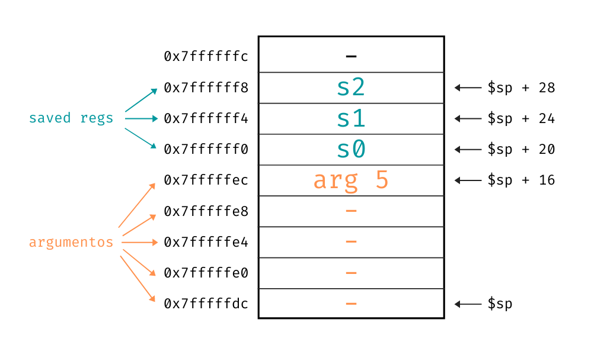
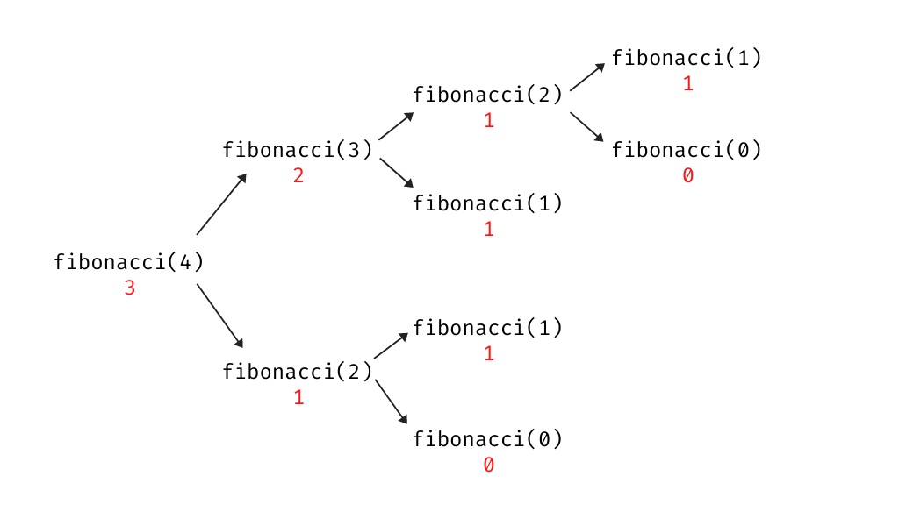

Tercera parte de la introducción a _assembler_ de MIPS. Links de la [parte 1](https://la35.net/orga/mips-intro.html) y [parte 2](https://la35.net/orga/mips-branchs.html). Todo el código de los ejemplos disponible en [GitHub](https://github.com/santiagotrini/mips-funciones).

# Contenidos
{:.no_toc}

1. Generated ToC
{:toc}

## Algunas definiciones

Una función o subrutina es un segmento de código distinto del código principal que puede ser invocado o llamado desde este último. Un ejemplo en C llamando a una función definida en el mismo archivo.

```c
#include <stdio.h>

void hola() {
  printf("Hola mundo!\n");
}

int main() {
  hola();
  return 0;
}
```

Por convención en C (y muchos otros lenguajes) decimos que la función `main` es el código principal. La función `hola` en este caso es llamada desde `main`. En la función `hola` tenemos el ejemplo más sencillo posible de una función. No tiene argumentos y no devuelve nada. Tampoco llama a otra función, decimos que es una **función o subrutina hoja** (_leaf_ en inglés) por como quedaría representada en un [grafo o árbol de llamadas](https://en.wikipedia.org/wiki/Call_graph).

Es importante también distinguir entre el código que llama a la función y el código que es llamado, o sea el código de la función llamada. En este caso `main` es el "llamador" y `hola` es el "llamado". Como estos términos en español suenan bastante raro vamos a usar los términos en inglés siguiendo la tradición. El _caller_ es el que llama, el _callee_ es la función o código llamado o invocado.

En realidad no es del todo cierto lo que dije antes, la función hola no es una función hoja en C, está llamando a `printf()` que también es una función. Pero en el ejemplo que sigue traducimos el código a _assembler_ de MIPS y ahí sí que tenemos una función que no llama a otra función.

```
.data
msg: .asciiz "Hola mundo!\n"

.text
.globl main

main:                   # int main()
jal       hola          #   hola();
li        $v0, 10       #
syscall                 #   return 0;

hola:                   # void hola()
la        $a0, msg      #
li        $v0, 4        #
syscall                 #   printf("Hola mundo!\n");
jr        $ra           #
```

## Llamar y volver de una función

En el ejemplo anterior vemos como novedad las instrucciones `jal` y `jr`.
La instrucción `jal` de _jump and link_ guarda el valor del PC + 4 (la dirección de la próxima instrucción) en `$ra` y salta a la etiqueta especificada. La instrucción `jr` de _jump register_ salta a la dirección de memoria contenida en un registro.

El código de una función, ya sea `main` o cualquier otra está agrupado en direcciones de memoria contiguas. Cuando la ejecución del código salta de una función a otra tiene que saber en qué instrucción del _caller_ se había quedado para volver a ejecutar desde ese punto cuando la función llamada retorne (_return_). La manera más simple de hacerlo es usando `jal` que guarda el valor correcto al que regresar en `$ra`. El registro `$ra` recibe su nombre por _return address_ o **dirección de retorno**.
El equivalente en MIPS al `return` de C es entonces simplemente un `jr $ra`.

Esta es la manera más simple de trabajar con funciones porque no hay que pasar argumentos ni devolver ningún valor de la función. Veamos un caso un poco más complicado.

## Argumentos y valores de retorno

Ya si nos ponemos a trabajar con funciones que reciben argumentos o devuelven valores necesitamos adoptar alguna convención. Para pasar argumentos o devolver valores podemos usar registros, memoria o una combinación de ambos. Pero tenemos que ponernos de acuerdo entre los programadores de qué manera vamos a hacerlo, para que uno pueda escribir código que otros programadores puedan usar en el futuro.

Esto se conoce como [convención de llamada](https://es.wikipedia.org/wiki/Convenci%C3%B3n_de_llamada_a_funci%C3%B3n) y existe una, o al menos debería existir, para cada lenguaje ensamblador. Lamentablemente en MIPS no hay una convención aceptada por todos como la única, pero las distintas propuestas son similares para lo que vamos a hacer nosotros.

En el caso de querer pasar argumentos a una función usamos los registros `$a0`, `$a1`, `$a2` y `$a3`. Si tenemos más de cuatro argumentos en una función tenemos que ir a la memoria, pero eso lo explico más adelante.
El _caller_ tiene que setear los valores de los argumentos **antes** de llamar a la función, lógicamente.

Para devolver valores tenemos los registros `$v0` y `$v1`, aunque es raro que devolvamos más de un valor de una función. En general si una función produce un resultado, el _caller_ debería encontrar ese resultado en `$v0`.
Veamos esto con un ejemplo, primero en C, de una función que suma dos números enteros.

```c
#include <stdio.h>

int suma(int a, int b) {
  return a + b;
}

int main() {
  int c = suma(5, 3);
  printf("%d\n", c);
  return 0;
}
```

Acá la función `suma()` toma dos argumentos enteros, `a` y `b` y devuelve la suma de ambos. La traducción a MIPS es sencilla.

```
.text
.globl main

main:                     # int main()
li        $a0, 5          #   // a = 5
li        $a1, 3          #   // b = 3
jal       suma            #   // suma(5, 3);
move      $a0, $v0        #   int c = suma(5,3);
li        $v0, 1          #
syscall                   #   printf("%d", c);
li        $v0, 10         #
syscall                   #   return 0;

suma:                     # int suma(int a, int b)
add       $v0, $a0, $a1   #   return a + b;
jr        $ra             #   
```

Acá usamos `jal` y `jr` como en el primer ejemplo. Pero antes de llamar a la función `suma` tenemos que poner el 5 y el 3 en `$a0` y `$a1`. La función `suma` pone el resultado de la suma de los argumentos en `$v0` y la función `main` que es el _caller_ busca en `$v0` el resultado para imprimir a consola, copiándolo a `$a0` para la _syscall_ de _print integer_.

## La pila de llamadas

Supongamos ahora que tenemos la función `main` y una función `cuenta` y ambas quieren usar el registro `$s0`. Primero vemos el ejemplo en C.

```c
#include <stdio.h>

int cuenta(int a, int b, int c, int d) {
  return (a + b) - (c + d);
}

int main() {
  int a = 12;
  int b = cuenta(1, 1, -1, 2);
  b = b + a;
  printf("%d\n", b);
  return 0;
}
```

Esperamos que el valor final de `b` sea 13. Traducimos este programa a MIPS.

```
.text
.globl main

main:
li          $s0, 12         # int a = 12;
li          $a0, 1          #
li          $a1, 1          #
li          $a2, -1         #
li          $a3, 2          #
jal         cuenta          # int b = cuenta(1, 1, -1, 2);
add         $a0, $v0, $s0   # b = b + a;
li          $v0, 1          #
syscall                     # printf("%d\n", b);
li          $v0, 10         #
syscall                     # return 0;

cuenta:
add         $s0, $a0, $a1   #
add         $s1, $a2, $a3   #
sub         $v0, $s0, $s1   #
jr          $ra             # return (a + b) - (c + d);
```

Y si lo hacemos de esta manera el resultado que nos da es 3, ¿por qué?
Bueno, el problema es que cuando `main` llama a `cuenta` todavía necesita trabajar con el valor que puso en `$s0`. Pero `cuenta` sobreescribe el 12 de `$s0` con un 2.

Cuando nuestro código necesita preservar el valor de algún registro decimos que tenemos que volcar el registro en memoria. Esto es lo que se conoce en inglés como _register spilling_. En el contexto de una llamada a una función el lugar de la memoria donde volcamos registros y en general guardamos cualquier cosa relacionada a una función es en la **pila de llamadas**, conocida también como _call stack_ o simplemente _stack_.

En MIPS el _stack_ empieza en la dirección `0x7ffffffc` y crece hacia abajo por razones históricas. Para manipular el _stack_ podemos usar el registro `$sp` o _stack pointer_ que apunta justamente al último elemento en la pila, que es el que está en la "cima".

Entonces para traducir correctamente el último programa a MIPS tenemos que volcar el registro `$s0` a la pila para preservar su valor. ¿Pero en qué parte del código hacemos esto? La convención de llamada para MIPS dice que los registros `$s0` a `$s7`, el `$sp` y el `$ra` deben ser preservados a través de llamadas a funciones. En cambio los registros temporarios (`$t0` a `$t9`), los registros de argumentos y valores de retorno no deben ser preservados.

|Registros preservados|Registros no preservados|
|---------------------------|------------------------------|
|Registros salvados: `$s0` a `$s7`|Registros temporarios: `$t0` a `$t9`|
|_Stack pointer_            |Argumentos: `$a0` a `$a3`           |
|_Return address register_  |Valores de retorno: `$v0` y `$v1`   |


Esto en realidad quiere decir que el _callee_ tiene la responsabilidad de volcar los registros que deben preservarse, si es que los va a usar. Si el _callee_ quiere usar el registro `$s0` tiene que volcarlo a la pila porque es posible que el _caller_ los necesite.

El _caller_ en cambio no puede esperar que el _callee_ preserve el registro `$a0`, `$v1` o `$t7`, si es necesario guardarlos es responsabilidad de él mismo. Entonces en el ejemplo que dimos es responsabilidad de la función `cuenta` volcar `$s0` en la pila ya que lo va a utilizar. El código ahora sí teniendo en cuenta esto quedaría así.

```
.text
.globl main

main:
li          $s0, 12         # int a = 12;
li          $a0, 1          #
li          $a1, 1          #
li          $a2, -1         #
li          $a3, 2          #
jal         cuenta          # int b = cuenta(1, 1, -1, 2);
add         $a0, $v0, $s0   # b = b + a;
li          $v0, 1          #
syscall                     # printf("%d\n", b);
li          $v0, 10         #
syscall                     # return 0;

cuenta:
                            # prologo de la funcion
addi        $sp, $sp, -4    # hacer lugar en el stack para un word
sw          $s0, 0($sp)     # push s0
                            # fin prologo
add         $s0, $a0, $a1   #
add         $s1, $a2, $a3   #
sub         $v0, $s0, $s1   # return (a + b) - (c + d);
                            # epilogo de la funcion
lw          $s0, 0($sp)     # pop s0
addi        $sp, $sp, 4     # liberamos espacio en el stack
                            # fin epilogo
jr          $ra             # return (a + b) - (c + d);
```

En este ejemplo `cuenta` empuja (_push_) en la pila el valor de `$s0` en el prólogo de la función y restaura su valor en el epílogo, justo antes del `jr $ra`. Para empujar un valor en la pila primero tenemos que "hacer espacio" restando la cantidad de bytes que vamos a ubicar en la pila al _stack pointer_. En este caso restamos 4 bytes porque vamos a guardar solo `$s0` en la pila. Usamos `sw` para empujar en la pila y `lw` para extraer (_pop_) de la misma. Recuerden que restamos del `$sp` para hacer espacio porque el _call stack_ crece "hacia abajo", desde direcciones de memorias altas a bajas.

## Stack frames

En realidad cada vez que llamamos a una función estamos empujando un _stack frame_ en la pila. Un _stack frame_ contiene todos las variables locales a una llamada de una función. Vale la aclaración, uno por cada llamada, no por cada función. Si estamos usando una función recursiva como factorial de 4 tendremos 4 _stack frames_, uno por cada llamada hasta que devuelve el valor final aunque la función sea siempre la misma.

Cuando adoptamos una convención de llamada tenemos que especificar como va a estar formado cada _stack frame_. En nuestro caso cada _frame_ va a estar dividido en cuatro secciones. Contando desde la cima de la pila, o sea desde el valor del _stack pointer_ quedaría así.

1. Argumentos
2. Los registros salvados (`$s0` a `$s7`)
3. El valor de `$ra`, o sea el _return address_
4. Si las hubiera, variables locales a la función

Todos estos segmentos son opcionales, los usamos solo si son necesarios, pero siempre respetando ese orden. Recuerden que si bien decimos que el _stack pointer_ apunta a la cima de la pila, la pila crece hacia abajo en la memoria.

{:.zoom}

En el ejemplo anterior la función `cuenta` tenía que salvar el registro `$s0` y para eso lo empujaba a la pila. Los otros segmentos en ese caso no eran necesarios. La longitud de cada segmente también dependerá de cada función, salvo por el _return address_ que siempre son 4 bytes.

Ahora supongamos que tenemos una función que lleva 5 argumentos. Como no tenemos 5 registros de argumentos tenemos que _pushear_ el quinto argumento en el _stack frame_ de la función. Aunque usamos los registros `$a0` a `$a3` para los primeros cuatro argumentos, conviene dejar el espacio en el _stack frame_ para los primeros cuatro argumentos también, por si la función necesita preservar los primeros cuatro argumentos si es el _caller_ de otra función.

```
# main llama a argumentos(1, 2, 3, 4, 5) e imprime el resultado
# argumentos equivale en C a
# int argumentos(int a, int b, int c, int d, int e) {
#   return (a + b) + (c + d) - e;
# }

.text
.globl main

main:
li          $a0, 1          # arg 1
li          $a1, 2          # arg 2
li          $a2, 3          # arg 3
li          $a3, 4          # arg 4
li          $t0, 5          # arg 5
addi        $sp, $sp, -32   # hacer espacio en el stack
sw          $t0, 16($sp)    # push arg 5 en el stack
jal         argumentos      # call argumentos(1, 2, 3, 4, 5)

move        $a0, $v0        # mover el resultado
li          $v0, 1          #
syscall                     # print resultado

li          $v0, 10         #
syscall                     # exit

argumentos:
                            # prologo
sw          $s0, 20($sp)    # guardar los registros que usamos
sw          $s1, 24($sp)    #
sw          $s2, 28($sp)    #
                            # fin prologo

add         $s0, $a0, $a1   # $s0 = a + b
add         $s1, $a2, $a3   # $s1 = c + d
add         $s2, $s0, $s1   # $s2 = $s0 + $s1
lw          $t0, 16($sp)    # load arg 5
sub         $v0, $s2, $t0   # $v0 = $s2 - e

                            # epilogo
lw          $s0, 20($sp)    # restaurar los registros que usamos
lw          $s1, 24($sp)    #
lw          $s2, 28($sp)    #
addi        $sp, $sp, 32    # liberar espacio
                            # fin epilogo
jr          $ra             # return
```

El _stack frame_ de la función `argumentos`, suponiendo que el _stack pointer_ tuviera el valor de `0x7ffffffc` al iniciar el programa sería el siguiente. Noten que estamos guardando `$s0`, `$s1` y `$s2` aunque no pasaría nada si no lo hacemos, pero habíamos acordado en nuestra convención de llamada que el _callee_ siempre tiene que preservar los _saved registers_ si los utiliza.

{:.zoom}

## Funciones que llaman a otras funciones

El caso más interesante para entender como funciona la pila de llamadas y los _stack frames_ es el caso de una **función no hoja** (_non leaf function_). Reciben ese nombre porque si uno dibuja un árbol donde el tronco es la función `main` y cada llamada a una función abre una nueva rama, las hojas del árbol son las funciones que no llaman a ninguna otra función.

Un caso especial de estas funciones que llaman a otras funciones son las funciones recursivas, que se llaman a sí mismas. Todas las funciones que llamen a otras funciones son _callee_ y _caller_ al mismo tiempo, y siempre deben preservar en el _stack_ el _return address_, porque al llamar una función con `jal` estamos sobreescribiendo el valor previo de `$ra`.

Como ejemplo podemos usar una función que calcula el enésimo número de Fibonacci. Por ejemplo si llamamos `fibonacci(0)` el resultado es 0. Para `fibonacci(10)` el resultado es 55.

Implementar esta función en C de manera recursiva es muy sencillo.

```c
#include <stdio.h>

int fibonacci(int n) {
  if (n == 0 || n == 1)
    return n;
  else
    return fibonacci(n - 1) + fibonacci(n - 2);  
}

int main() {
  printf("%d\n",fibonacci(10));
  return 0;  
}
```

Para traducir esta función a MIPS tenemos que tener cuidado de salvar el _return address_ y cualquier otro registro que necesitemos antes de llamar a `fibonacci(n - 1)` y `fibonacci(n - 2)`. Cada llamada tendrá su _stack frame_ en la pila.

```
.text
.globl main

main:
li          $a0, 10         # n = 10
jal         fibonacci       # fibonacci(n)
move        $a0, $v0        # copio el resultado
li          $v0, 1          #
syscall                     # print resultado
li          $v0, 10         #
syscall                     # exit

fibonacci:
                            # prologo
addi        $sp, $sp, -20   # 5 words para el stack frame
sw          $a0, 0($sp)     # guardar a0
sw          $s0, 4($sp)     # guardar s0
sw          $s1, 8($sp)     # guardar s1
sw          $s2, 12($sp)    # guardar s2
sw          $ra, 16($sp)    # guardar ra
                            # fin prologo

li          $s0, 1          # s0 = 1 (para el beq)

beq         $a0, $zero, f0  # if (n == 0)
beq         $a0, $s0, f1    # if (n == 1)

addi        $a0, $a0, -1    # n - 1
jal         fibonacci       #
move        $s1, $v0        # s1 = fibonacci(n - 1)
addi        $a0, $a0, -1    # ya le habiamos restado 1 antes
jal         fibonacci       #
move        $s2, $v0        # s2 = fibonacci(n - 2)
add         $v0, $s1, $s2   # return s1 + s2
j           return          # vamos a return

f0:                         # caso base fibonacci(0)
li          $v0, 0          # return 0
j           return          #
f1:                         # caso base fibonacci(1)
li          $v0, 1          # return 1
j           return          #

return:
                            # epilogo
lw          $a0, 0($sp)     # recuperar a0
lw          $s0, 4($sp)     # recuperar s0
lw          $s1, 8($sp)     # recuperar s1
lw          $s2, 12($sp)    # recuperar s2
lw          $ra, 16($sp)    # recuperar ra
addi        $sp, $sp, 20    # pop stack frame
                            # fin epilogo
jr          $ra             # return
```

Noten que cada vez que llamamos a `fibonacci(n)` empujamos un _stack frame_ encima de los anteriores moviendo el _stack pointer_. Cada vez que volvemos de la función quitamos de la pila el último _stack frame_ y movemos el `$sp`.

Cabe destacar que cuando en el epílogo guardamos `$a0` la función lo hace porque es el _caller_ y tiene que sobreescribirlo para llamar a `fibonacci(n - 1)` y `fibonacci(n - 2)`. En cambio cuando guarda `$ra` y los registros `$s0`, `$s1` y `$s2` lo hace desde el lugar del _callee_.

{:.zoom}

La imagen de arriba ilustra el árbol de llamadas de `fibonacci(4)` donde se puede ver claramente la diferencia entre los casos de funciones o subrutinas _leaf_ y _non leaf_. En rojo aparecen los valores de retorno de cada llamada.

Este código podría mejorarse bastante para evitar lo más posible el _register spilling_ en la pila. Por ejemplo en los casos base de la función no necesitamos preservar `$ra`. Esas optimizaciones se las dejo como tarea a ustedes.
