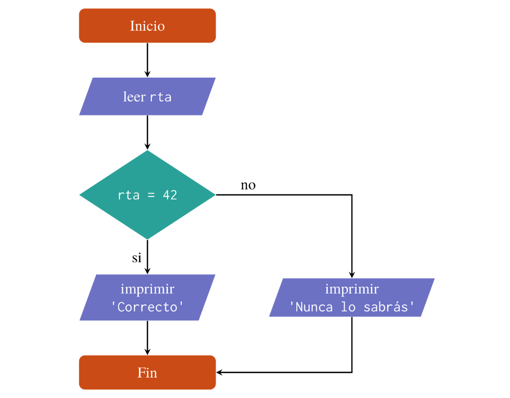

Las tres tecnologías mas importantes del desarrollo web son HTML, CSS y JavaScript. De estos tres el único que es un lenguaje de programación de propósito general es JavaScript.

JavaScript, también llamado JS o ECMAScript es un lenguaje de programación con una sintaxis influenciada por C. A diferencia de C es un lenguaje interpretado.

Que sea un lenguaje interpretado quiere decir que corre sobre otro programa (el intérprete) y hay dos intérpretes que nos importan para este lenguaje. Uno es el navegador (sea Chrome, Firefox, Edge, Safari, etc.) y el otro es NodeJS que se ejecuta generalmente del lado del servidor.

Que todos los navegadores web modernos tengan un intérprete de JavaScript no nos sorprende, porque justamente este lenguaje se inventó para su uso en los sitios web.

No hay que confundir Java con JavaScript, son dos lenguajes diferentes que lo único que tienen en común es el nombre y una sintaxis similar a C. La gente que inventó JavaScript lo hizo en un momento en el que Java se estaba haciendo muy conocido y se copiaron un poquito del nombre por razones de marketing.

## Ejecutar código de JavaScript

Para empezar necesitamos un lugar donde ejecutar código de JS. La manera más fácil es desde nuestro navegador (funciona en Chrome y Firefox seguro) presionando <kbd>F12</kbd>. Obtenemos un panel que son las herramientas para desarrolladores. En la pestaña "Console" podemos tipear código y ejecutarlo usando la tecla <kbd>Enter</kbd>. Probemos con el programa "Hello world" como manda la tradición.

{:.zoom}

Para insertar una nueva línea pueden usar <kbd>Shift</kbd> \+ <kbd>Enter</kbd> en la consola.

## Comentarios

Lo primero que aprendemos cuando nos metemos a un nuevo lenguaje de programación son los comentarios. Ya les dije que se parecía a C en la sintaxis, los comentarios no son la excepción.

```js
// los comentarios empiezan con //
// y duran hasta que termina la linea

console.log('Esta linea no es un comentario');

/*
este es un comentario multilinea
sigue aca
y termina en la linea de abajo
*/
```

## Variables

Declarar y asignar valores a variables es fácil en JavaScript.

```js
let a;      // declara una variable llamada 'a'
let b = 2;  // declara una variable y le asigna un 2
a = 1;      // le asigno un 1 a la primer variable
            // ya estaba declarada, no hace falta el 'let'

const c = 9.82;  // declaro una constante 'c' con valor 9.82
                 // a los nombres declarados con 'const'
                 // no se les puede reasignar otro valor
a = 'Hola'       // las variables hechas con 'let' no tienen ese problema
```

## Tipos de datos

Los valores que les asignamos a las variables pueden ser de distintos tipos. Fijense que a diferencia de C, una variable no es de tipo `int` o `char`, una misma variable puede tener un número en un momento y el nombre de una mascota en otro.

Los tipos en JavaScript son los siguientes.

```js
// numeros
let a = 12, b = 3.14, c = Infinity;
// fijense que no distingue entre numeros con coma decimal o enteros

// strings
let mensaje = "hola", asd = 'asjhdj2h3jjhajs##d@h';
// son cadenas de caracteres, podemos usar comillas dobles o simples
// pero preferimos las simples

// boolean
let verdadero = true, falso = false;
// un tipo de dato con dos valores posibles
// las palabras true y false van sin comillas

// objeto
let objeto = {};
// muchas cosas que van a ir apareciendo son objetos
```

Si estás en duda de qué tipo es algún dato en particular, lo más simple es usar el operador `typeof`.

```js
typeof 12;
// -> "number"
typeof true;
// -> "boolean"
```

## Operaciones

Cada tipo de dato tiene una serie de operaciones, veamos las más básicas.

### Operaciones aritméticas

Las operaciones de suma, resta, multiplicación y división son las mismas que en C.

```js
let a = 2 + 3;
console.log(a);
// muestra 5
let b = 3 * (4 / 1) - 5;
console.log(b);
// muestra 7
```

Si queremos el resto de una división usamos el operador `%`.

```js
console.log(6 / 2); // muestra 3
console.log(6 % 2); // muestra 0
```

Existe un objeto llamado `Math` con varias operaciones matemáticas más avanzadas.

```js
console.log(Math.PI);               // 3.14159...
console.log(Math.pow(2,3));         // 8
console.log(Math.sin(Math.PI / 2)); // 1
```

### Operaciones lógicas

También usa la misma sintaxis que C. Tenemos AND, OR y NOT. Operan sobre valores del tipo `boolean`, o sea verdadero o falso (`true` y `false`).
```js
true && true  // AND (da true)
true || false // OR  (da true)
!false        // NOT (da true)
```

### Operadores de comparación

Como su nombre lo indica, comparan dos cosas, generalmente del mismo tipo. Tenemos los siguientes:

- Igualdad (`==`)
- Desigualdad (`!=`)
- Mayor que (`>`)
- Menor que (`<`)
- Mayor o igual que (`>=`)
- Menor o igual que (`<=`)

Estos operadores producen un valor booleano, ejemplos:
```js
3 < 4                  // true
!(4 > -4)              // false
4 == (2 + 2)           // true
(3 * 3 != 2) || false  // true
```

### El operador ternario

Existe un único operador ternario, es decir, que tiene tres operandos. Todos los operadores que están arriba tienen dos operandos: la suma, la igualdad, etc.

El operador ternario sirve para producir un resultado si una condición es verdadera y otro si es falsa.

```js
// el operador ternario se escribe con '? :'
true ? 3 : 2       // el resultado es 3
false ? 6 : 'hola' // el resultado es 'hola'
```

## Funciones

Piensen en las funciones como un pedazo de código que usamos a menudo. Las funciones a veces nos vienen dadas (como `console.log()`) y a veces las definimos nosotros. Cuando las definimos nosotros les elegimos un nombre y escribimos el código para que hagan lo que queramos. Ejemplo:

```js
function saludar() {
  console.log('Hola');
}

// las primeras 3 lineas definen una funcion llamada saludar
// esta funcion imprime 'Hola' en la consola

saludar();  // resultado: 'Hola'

// la linea anterior llama a la funcion
```

Las funciones llevan paréntesis al lado de su nombre (tanto cuando las definimos como cuando las llamamos). Esos paréntesis están para poner argumentos, la función `saludar()` de arriba no tiene argumentos.

La próxima función se llama `saludarConNombre()` y lleva un argumento de tipo `string`.

```js
function saludarConNombre(nombre) {
  console.log('Hola, ' + nombre);
}

saludarConNombre('Maria');  // 'Hola, Maria'
saludarConNombre('Juan');   // 'Hola, Juan'
saludarConNombre(99);       // 'Hola, 99'
```

En el último ejemplo el operador `+` no suma números sino que "concatena _strings_".

Las primeras dos funciones no devuelven ningún valor, no producen un resultado. Imprimen en la consola sí, pero no cuenta como producir un valor. Para devolver un valor de una función usamos la palabra `return`. Veamos un último ejemplo, una función que suma dos números.

```js
function suma(a, b) {
  return a + b;
}

suma(3, 3);       // 6
suma(3, -3);      // 0
suma('doce', 2)   // doce2
```

En la última llamada a suma donde le pasamos un `string` tienen un ejemplo de un _bug_. Es decir un error en nuestro código que produce resultados inesperados sin detener la ejecución del mismo. Eso quiere decir que podríamos definir una versión mejor de `suma` que evite este problema.

## Tipos de datos: objetos y arrays

Hasta ahora trabajamos con números, _strings_ y valores booleanos. Estos tipos de datos nos sirven cuando le queremos dar un nombre a un solo valor.

Supongamos que nuestro código dice algo sobre alguno de ustedes como alumno y queremos guardar la edad, el DNI, el nombre o si es un alumno regular. Los tipos de datos que guardan un solo valor decimos que son **primitivos**.

```js
let nombre = 'Juan';
let edad = 17;
let dni = 44123123;
let regular = true;
```

### Objetos

Pero a menudo queremos guardar toda esa información en una sola variable, bajo el mismo nombre. En ese caso podemos usar el tipo de dato **objeto**. Un objeto es una **colección de pares de clave y valor**. Ponemos un ejemplo.

```js
let alumno = {
  nombre: 'Juan',
  edad: 17,
  dni: 44123123,
  regular: true
};
```

En el ejemplo anterior todo lo que está entre las llaves es un objeto, que en este caso consiste de cuatro pares de claves con sus respectivos valores. Las claves son nombre, edad, DNI y regular. Los valores que les damos están a la derecha de los dos puntos.

A cada una de las claves también las llamamos **propiedades**. Si queremos imprimir en consola el valor de alguna propiedad del objeto usamos o el punto o los corchetes para acceder a los valores como se muestra en el siguiente ejemplo.

```js
console.log(alumno.nombre);  // imprime Juan
console.log(alumno[edad]);   // imprime 17
```

En general preferimos usar la notación con el punto ya que es más concisa, aunque si se quiere acceder a una propiedad por medio de una variable tenemos que usar los corchetes.

```js
let propiedad = 'dni';
console.log(alumno[propiedad]);   // imprime 44123123
propiedad = 'edad';
console.log(alumno[propiedad]);   // imprime 17
```

La manera más sencilla de crear un objeto vacío en JavaScript es usando un par de llaves vacías en una asignación.

```js
let alumno2 = {};
```

Podemos agregar propiedades a un objeto en cualquier momento usando el operador de asignación.

```js
alumno2.nombre = 'Maria';
alumno2.edad = 18;
```

Noten que hasta ahora usé tipos primitivos para los valores, pero nada me impide guardar un objeto dentro de otro objeto.

```js
let zoologico = {
  direccion: 'Sarmiento 1234',
  elefante: {
    nombre: 'Dumbo',
    peso: 2000
  },
  cerrado: true
}
```

### Arrays

Supongamos ahora que queremos agregar una lista con las notas de Juan a nuestro primer objeto. En este caso el tipo de dato más conveniente es un **array**, que internamente es un objeto, pero es un objeto especial con su sintaxis propia. Un arreglo, o más comunmente _array_ por su nombre en inglés es una lista de valores separados por comas entre dos corchetes.

```js
alumno.notas = [10, 6, 7, 8];
```

No necesitan estar dentro de un objeto como vemos en el siguiente ejemplo.

```js
let frutas = ['manzanas', 'peras', 'naranjas'];
console.log(frutas[2]); // imprime naranjas
```

La manera de acceder a un elemento en un _array_ es usando corchetes para indicar el índice en la lista. Cada elemento del _array_ tiene su número o índice. Si el _array_ tiene $n$ elementos el primer índice es 0 y el último $n - 1$. Ojo con eso que es causa de muchos errores.

Si queremos crear un _array_ vacío, simplemente usamos corchetes vacíos de manera similar a como hicimos con los objetos.

```js
let lista = [];
```

La manera más común de agregar y quitar elementos de un _array_ es usando los métodos `push()` y `pop()` que reciben esos nombres por un tipo de dato abstracto llamado [pila](https://es.wikipedia.org/wiki/Pila_(inform%C3%A1tica)).

```js
lista.push(1);
lista.push(2);
console.log(lista);  // imprime [1, 2]
lista.pop();
console.log(lista);  // imprime [1]
```

Noten que `push()` lleva como argumento el elemento que agregamos al _array_, `pop()` en cambio no lleva argumento porque siempre elimina (y devuelve también) el último elemento del _array_.

Todos los _arrays_ son objetos, y los objetos pueden tener propiedades como dijimos arriba. Todos los _arrays_ tienen una propiedad llamada `length` (longitud) que nos da el número de elementos del _array_.

```js
let numeros = [1, 2, 3, 4, 5];
console.log(numeros.length);  // imprime 5
```

## Enunciados y expresiones

Antes de hablar de las estructuras de control en JavaScript hay que distinguir entre enunciados y expresiones. Un **enunciado** es generalmente una línea de código terminada en punto y coma. Es el análogo a una oración en español y un programa en JavaScript no es más que una lista de enunciados.

```js
let a = 12;
let b = 13;
let c = a + b;
console.log(c);
```

En el ejemplo anterior tenemos cuatro enunciados, lo normal es que aparezca cada uno en su línea. Los tres primeros enunciados están declarando y asignando valores a una variable y el último es una llamada a la función `console.log()`.

Una **expresión** es un fragmento de código que produce un valor. En el ejemplo anterior `12`, `13`, `a + b` son expresiones. Más ejemplos de expresiones que no son enunciados:

```js
true && false
45 >= 23
(123 * 54) % 2
(4 > b) ? 'si' : 'no'
```

## Flujo de un programa

Para estudiar las denominadas **estructuras de control** que tienen que ver con el orden en el que se ejecutan los distintos enunciados de un programa, conviene tener alguna forma de representar gráficamente el flujo de las instrucciones.

Una de las maneras más tradicionales de hacer esto es mediante los **diagramas de flujo**. Los diagramas de flujo utilizan símbolos y flechas para representar la ejecución de programas y algoritmos.

{:.zoom}

El diagrama de flujo que ven arriba corresponde a un programa que lee un número e imprime, en consola tal vez, el valor absoluto del mismo.

Las flechas indican el sentido en el que se ejecutan las instrucciones entre los dos rectángulos con bordes redondeados que indican el **principio** y el **fin** del programa. Los paralelogramos se utilizan para indicar **entrada o salida** de datos. Los rectángulos con bordes rectos indican **procesos** (como asignar a una variable el resultado de una operación aritmética). Por último los rombos indican **decisiones**.

### Secuencial

La manera más simple en la que se puede ejecutar un programa es secuencialmente. Las instrucciones o enunciados del programa se ejecutan tal como se leen, de arriba hacia abajo mientras van apareciendo.

```js
let a = prompt();
a = a + 16;
console.log(a);
```

{:.zoom}

### Condicional

La estructura de control condicional se realiza por medio de `if ... else` en JavaScript y en muchos otros lenguajes. Sirve para elegir entre dos caminos posibles de ejecución. Si lo usamos sin la claúsula `else` sirve para ejecutar código sólo si se cumple una **condición**. La condición siempre aparece dentro del rombo en el diagrama de flujo.

```js
let rta = prompt();
if (rta == 'y') {
  console.log('Sí');
}
```

{:.zoom}

Como se ve en el diagrama de flujo si la condición no se cumple todo lo que está entre las llaves del `if` no se ejecuta, se lo pasa de largo.

Otra opción es tener dos conjuntos de instrucciones, uno si se cumple la condición y otro si no se cumple. Para eso está la claúsula `else`. Vemos un ejemplo.

```js
let rta = prompt('¿Cuál es el sentido de la vida?');
if (rta == 42) {
  console.log('Correcto');
} else {
  console.log('Nunca lo sabrás');
}
```

{:.zoom}

También podemos tener condicionales anidados. En el siguiente ejemplo el segundo `if ... else` es parte de la claúsula `else` del primer condicional.

```js
let rta = prompt();
if (rta == 'y') {
  console.log('si');
} else if (rta == 'n') {
  console.log('no');
} else {
  console.log('respuesta invalida');
}
```

{:.zoom}

Entonces la estructura de control condicional se realiza por medio de `if (condicion)` donde la condición es cualquier expresión que evalúa a `true` o `false` seguido de un **bloque** de código delimitado por llaves `{ ... }` y dentro de ese bloque hay uno o más enunciados. Luego del primer bloque de enunciados puede seguir opcionalmente una claúsula `else { ... }` con sus enunciados o una claúsula `else if (condicion) { ... }`. Cuando digo enunciados estoy usando la palabra en sentido técnico como la definí más arriba.

Justamente la distinción entre enunciados y expresiones es útil para entender la diferencia entre la estructura condicional y el operador ternario. En el `if ... else` los bloques (lo que está entre llaves) contienen enunciados. En el operador ternario los tres operandos tienen que ser expresiones.

```js
let a = true;
a ? return 1; : return 2;  // incorrecto (return 1; es un enunciado)

// forma correcta con if ... else
if (a) return 1; else return 2;
```

Noten que en el ejemplo de arriba omito las llaves, eso se puede hacer cuando hay un solo enunciado que se desea ejecutar si se cumple la condición.

### Iterativo

La otra estructura de control que tenemos a nuestra disposición es la llamada **iterativa**. Una iteración es una repetición, pero en computación queda bien decirlo así, iteración. Los ciclos de repetición, bucles, _loops_, estructuras de control iterativas, todas esas palabras hacen referencia a lo mismo: **ejecutar una serie de enunciados una y otra vez como en un ciclo mientras o hasta que se cumpla una condición dada**.

Los más usados en JavaScript y en muchos lenguajes son los ciclos `while` y `for`. Vemos primero el diagrama de flujo de un programa que imprime los diez primeros números naturales en consola.

{:.zoom}

Si leemos el diagrama en palabras diría algo así: asigno 1 a $n$, **mientras** $n$ sea menor o igual a 10 imprimo $n$ e incremento en 1 la variable, vuelvo a repetir desde la pregunta $n <= 10$, cuando la respuesta es negativa termino el programa.

En JavaScript es practicamente lo mismo. Noten que _while_ significa mientras en inglés.

```js
let n = 1;
while (n <= 10) {
  console.log(n);
  n++;             // incrementa en 1, lo mismo que n = n + 1
}
```

Otra manera de escribir el mismo código en menos líneas es usando el ciclo `for`. En el código de arriba tenemos declaración de variable e inicialización en la primer línea. Una condición entre paréntesis en el `while` y el incremento de la variable $n$ en la cuarta línea.

El ciclo `for` me permite escribir todo esto entre paréntesis en una sola línea separando cada una de estas operaciones con punto y coma.

```js
for (let n = 1; n <= 10; n++) {
  console.log(n);
}
```

De la misma manera que con la estructura condicional, el bloque de enunciados delimitado por llaves es lo que se repite mientras se cumpla la condición. Al igual que con `if ... else` podemos omitir las llaves cuando hay un solo enunciado como en el ejemplo de arriba.

Al igual que los condicionales los ciclos pueden estar dentro de otros ciclos, o como decimos a veces, anidados. Vemos un ejemplo con la suma de matrices en matemática.

Una matriz es un arreglo rectangular de números.

$$
        A = \begin{bmatrix}
            1 & 0 & 2 \\
            4 & 1 & 1 \\
            2 & 0 & 1
            \end{bmatrix} \hspace{5mm}
        B = \begin{bmatrix}
            2 & 1 & 0 \\
            1 & 0 & 2 \\
            4 & 3 & 1
            \end{bmatrix}
        $$

La suma de matrices $A+B = C$ se define para matrices del mismo tamaño, como las de arriba que son de $3 \times 3$ como la suma elemento a elemento de cada número.


$$ C=\begin{bmatrix} 1+2 & 0+1 & 2+0\\4+1 & 1+0 & 1+2\\2+4 & 0+3 & 1+1 \end{bmatrix}$$


Para representar matrices en JavaScript podemos usar _arrays_ dentro de _arrays_, y para realizar la suma usamos dos ciclos `for` anidados.


```js
// declaro las matrices A y B y una matriz C vacía
let a = [
  [1, 0, 2],
  [4, 1, 1],
  [2, 0, 1]
];
let b = [
  [2, 1, 0],
  [1, 0, 2],
  [4, 3, 1]
];
let c = [
  [0, 0, 0],
  [0, 0, 0],
  [0, 0, 0]
];
// recorro las matrices y hago la suma con dos ciclos for
for (let i = 0; i < 3; i++) {
  for (let j = 0; j < 3; j++) {
    c[i][j] = a[i][j] + b[i][j];
  }
}
```

Los nombres que les dí a los índices: `i` y `j` son los que se usan tradicionalmente (letras a partir de la "i" de índice). Acá `i` representa la fila y `j` la columna.

Para acceder al _array_ dentro del _array_ simplemente usamos los dos índices, uno al lado del otro: `c[i][j]`. Recuerden que los _arrays_ cuentan desde 0, las filas están numeradas del 0 al 2 al igual que las columnas. En un diagrama de flujo se vería así.

{:.zoom}

Fijense que para cada vuelta que da el ciclo de afuera (el de las filas) el de adentro da tres vueltas (el de las columnas). Esto tiene sentido ya que en estas matrices de $3 \times 3$ la suma se repite 9 veces ya que es la cantidad de elementos en la matriz.

En aplicaciones reales este tipo de programas con dos ciclos anidados tratan de evitarse siempre que sea posible, y ya ver tres ciclos anidados es muy raro. Esto es por razones de rendimiento, si un solo ciclo ejecuta $n$ instrucciones, un doble ciclo anidado ejecuta $n^2$ instrucciones, y uno triple $n^3$. Cuando $n$ es grande esto puede llegar a ser muy ineficiente por más rápida que sea la computadora donde se ejecuta.

### Ciclos, objetos y arrays

Existen dos formas especiales del ciclo `for` para objetos y _arrays_. A menudo esta forma del ciclo `for` se la llama `for ... each`, que significa "para cada". Esto viene muy bien para trabajar con listas y objetos, como diciendo "para cada numero en la lista hacer tal cosa".

Ojo que en JavaScript no se usa la palabra clave `each` como en otros lenguajes y hay dos variantes, una para usar con _arrays_ y otra para objetos. Vemos algunos ejemplos.

```js
let numeros = [1, 2, 3, 4]
let elefante = {
  nombre: 'Dumbo',
  peso: 2000,
  edad: 87
};

// for ... of para arrays
for (let numero of numeros) {
  console.log(num);
}

// for ... in para objetos
for (let key in elefante) {
  console.log(elefante[key]);
}
```

Noten que hay que declarar una variable que usamos como índice, el nombre lo elegimos nosotros. En la versión del ciclo para objetos uso la palabra _key_ (clave en inglés) ya que es una opción que van a ver muy seguido en el código de otros. Recuerden que una clave es el nombre de una propiedad en un objeto.

En el ciclo para _arrays_ el patrón de usar el nombre en plural para la lista de elementos y usar la palabra en singular en el ciclo también es muy común.

## Estilo y calidad de código

Voy a mencionar brevemente las convenciones aceptadas por la gran mayoría de los seres humanos que programan. Para la computadora las dos funciones que siguen son exactamente iguales.

```js
// funcion 1
function cosa(perro,asdkajsdk){return perro                   +

    asdkajsdk

    }

// funcion 2    
function suma(a, b) {
  return a + b;
}    
```

Para un humano la segunda función está mucho mejor y es porque se entiende claramente la intención del programador y se lee fácil. Voy a dar un par de reglas para que la calidad del código sea pareja y no un capricho de cada uno.

Si uno no sigue ciertas reglas porque total la máquina lo entiende se gana el odio de sus compañeros programadores con los que trabaja. Siempre hay que pensar en los humanos que van a leer tu código.

### Nombres

En las expresiones de un lenguaje de programación aparecen valores literales como 12 o `true` pero también nombres. Los que elegimos para variables y funciones por ejemplo. Los nombres en JS siguen la convención denominada **camel case**. La idea es simple, los nombres empiezan en letras (a - z) y en miníscula. Si el nombre está compuesto de varias palabras se empieza cada palabra nueva con mayúscula. No hay espacios, no hay guiones y evitamos caracteres fuera del alfabeto inglés como la "ñ".

Además buscamos nombres descriptivos, nombres como "dato" o "valor" no son buenas elecciones para una variable.

```js
let dato = 1          // incorrecto (no descriptivo)
let numero = 42       // correcto
let Numero = 42       // incorrecto
let ti     = 23       // no! que es ti?
let tempInicial = 23  // mucho mejor
let TempInicial = 23  // mal esta en SnakeCase
```

Ya sé lo que van a decir, que yo uso letras sueltas para variables todo el tiempo. Lo importante es que se entienda el código, si el contexto es lo suficientemente claro no está necesariamente mal, y a todos nos gusta tipear menos.

Si nuestro programa hace cálculos de física con la segunda ley de Newton está perfecto llamar a las variables $F = ma$. Todos van a entender a la primera leída a qué hacen referencia esas letras.

### Indentación

La indentación son los espacios que dejamos a propósito desde el margen. Como cuando yo declaro una función, abro un bloque con llaves y dejo **dos** espacios. En general cada vez que abro un bloque dejo **dos** espacios. Y cuando digo espacios me refiero a espacios, caracter 32 de la tabla ASCII, no tabulaciones.

```js
function hola() {
  console.log('Hola');
  if (true)
    console.log('Chau');
  return 1;    
}
```

Fijense en el ejemplo que hay dos bloques, el de la función que se ven las llaves y el del condicional donde las omití. De todas maneras dejo los **dos** espacios de indentación para que sea vea visualmente (valga la redundancia) que hay un bloque de código ahí dentro del condicional.

Por si no se entendió, usar **dos espacios** para indentar, no tres, no cuatro, **dos**.

Además la indentación prolija me ayuda a distinguir entre un error de tipeo y lo que el programador quiso poner. En el ejemplo de arriba está claro que el único enunciado que va dentro del condicional es el `console.log()`. El `return 1` se entiende que no es parte del condicional porque está en otro nivel de indentación.

El ejemplo que sigue es parecido pero distinto, con el `return` dentro del condicional pero el programador se olvidó de poner las llaves. Uno detectaría el error al instante, faltan las llaves del `if`.

```js
function hola() {
  console.log('Hola');
  if (true)
    console.log('Chau');
    return 1;    
}
```

Estas reglas son suficientes por ahora. En general sigo las líneas de estilo de [Airbnb](https://github.com/airbnb/javascript).

La última recomendación es que se acostumbren a nombrar sus variables y funciones en inglés. Es lógico que si todas las palabras claves de los lenguajes de programación están en inglés. Y el desarrollo de software a menudo se hace entre equipos de distintos países con distintos idiomas, no es un capricho programar en inglés, es una forma de entenderse mejor.

La gran mayoría del código _open source_ que pueden encontrar en la web usa nombres en inglés, y no todos los que colaboran en esos proyectos tienen el inglés como lengua madre.

## Más sobre funciones

Muchos lenguajes de programación heredan su sintaxis de C, JavaScript es uno de ellos. Pero una de las grandes diferencias con C es que JavaScript permite al programador asignar o devolver funciones. En JavaScript una función es un tipo especial de objeto, y como tal, puede ser usado donde esperamos una expresión. Las funciones, se dice en la jerga, son _first class citizens_ y esto no sólo abre nuevas posibilidades (lo que se llama [paradigma de programación funcional](https://es.wikipedia.org/wiki/Programaci%C3%B3n_funcional)) sino que se utiliza frecuentemente en el código para desarrollo web.

### Expresiones de funciones

Hasta ahora vimos las declaraciones de funciones, ese es el estilo que se usa en C o Java. Por lo que dije arriba también podemos asignar una función a una variable. La manera de hacerlo se muestra en el siguiente ejemplo.

```js
// declaración de función
// f(x) = 2x
function lineal(x) {
  return 2 * x;
}

// expresión de función
// f(x) = 2x
let f = function(x) {
  return 2 * x;
};

// llamando las dos funciones de arriba
lineal(2);  // -> 4
f(2);       // -> 4
```

Noten las diferencias entre ambas. En primer lugar la segunda función no se llama `f`. Ese es el nombre de la variable, la función decimos que es anónima, a diferencia de la primera que se llama `lineal`. Si cambiamos el contenido de la variable `f` perdemos toda referencia a esa función y no la podemos usar más.

```js
f = 12;
console.log(f);  // 12
f(2);            // error: f no es una función
```

En segundo lugar noten que en la definición de `f` lo que está a la derecha del igual es una expresión, y todo junto es un enunciado. Y como tal termina en punto y coma a diferencia de la declaración de `lineal`.

En tercer lugar noten que el orden importa para las expresiones de funciones.

```js
f();          // error: f no está definido (todavía)
g();          // imprime 'Chau'

let f = function() { console.log('Hola'); };

f();          // sin problemas, imprime 'Hola'

function g() {
  console.log('Chau');
}
```

### Funciones flecha

Hay una manera compacta de escribir funciones que vamos a usar muy seguido. La podemos usar siempre que se espere una expresión de función. No sirve para declarar funciones como venimos haciendo desde el primer apunte. Son las funciones flecha y son siempre funciones anónimas.

Vemos un ejemplo con la función suma.

```js
// f(x,y) = x + y
// declaración de función
function suma(x, y) {
  return x + y;
}

// expresión de función usando la palabra clave function
let f = function(x, y) {
  return x + y;
};

// función flecha
let f = (x, y) => x + y;
```

La flecha (`=>`) de las funciones flecha separa la lista de argumentos del cuerpo de la función. En el ejemplo de arriba hay un solo enunciado en el cuerpo de la función, en ese caso hay un `return` implícito (que no se escribe). Si hay más de un enunciado las llaves son obligatorias y hay que escribir el `return`.

```js
// g(x) = x^2
// si hay un solo argumento los paréntesis no son necesarios
let g = x => x * x;


// si no hay argumentos escribimos los paréntesis vacíos
let saludar = () => 'Hola';


// con varios enunciados
let imprimirMenu = () => {
  console.log("1) Altas");
  console.log("2) Bajas");
  console.log("3) Modificaciones");
  console.log("4) Salir");
};


// con varios enunciados pero que devuelva algún valor
let cuentaLoca = (a, b, c) => {
  a = b + c;
  b = c + a;
  c = a + b;
  return a * b * c;
};
```


### Callbacks

Por último tenemos que hablar de una consecuencia de poder usar funciones como expresiones, las **callbacks**. Un uso muy común de funciones como argumentos de otras funciones es cuando tenemos que realizar una operación que tiene duración, que no es instántanea.

El ejemplo más común en desarrollo web es cuando tenemos que ir a buscar información a través de la red a una base de datos, la solicitud del nombre de usuario y la contraseña por ejemplo. Como eso lleva tiempo pero nuestro código se escribe y se ejecuta de manera secuencial la gran parte del tiempo, le decimos a nuestro código que vaya a hacer la operación esa y que cuando termine ejecute una función.

Sin poner código para buscar algo en una base de datos remota podemos simular eso con una función que tenemos llamada `setTimeout(callback, delay)`. Esta función está disponible de la misma manera que `console.log()` no es parte del lenguaje pero casi siempre que estamos trabajando en JavaScript está disponible. Vemos el código.

```js
let saludo = () => console.log('Hola, ya pasaron 5 segundos');
setTimeout(saludo, 5000);
console.log('Acá esperando que pasen 5 segundos, esto sale primero');
```

Prueben eso en la consola de JavaScript. Noten que en `setTimeout()` el primer argumento es una función (la _callback_) y el segundo el tiempo que va a esperar para ejecutar esa función en milisegundos. Este ejemplo no es más que eso, un ejemplo pero ilustra perfecto el porqué del nombre ("volver a llamar"). Es como si el código volviera sobre sus pasos.

Obviamente que en cinco segundos como está en el ejemplo yo puse un solo enunciado pero JavaScript tiene tiempo para ejecutar miles de enunciados en ese intervalo. Y esa es la utilidad de estas funciones, porque la otra opción sería que mi programa no haga nada hasta que tenga la respuesta de la base de datos, cuando bien podría estar haciendo un montón de cosas. Les dejo otro ejemplo con `setInterval()` que es una función parecida, pruebenlo ustedes mismos en la consola.

```js
function clock(h, m, s) {
  setInterval(() => {
    let display, hd, md, sd;
    s++;
    if (s == 60) {
      s = 0;
      m++;
    }
    if (m == 60) {
      m = 0;
      h++;
    }
    if (h == 24) h = 0;
    hd = h.toString().padStart(2, '0');
    md = m.toString().padStart(2, '0');
    sd = s.toString().padStart(2, '0');
    display = `${hd}:${md}:${sd}`;
    console.log(display);
  }, 1000);
}
```

En este ejemplo la función está declarada ahí mismo, dentro de los paréntesis del `setInterval(callback, delay)`. El _delay_ es el 1000 (ms) que aparece en la anteúltima línea. También hago uso de los _backticks_ para el mensaje en la variable `display`. Esa forma de declarar _strings_ me permite **interpolar** variables en el texto, cosa que no podemos hacer con las comillas simples o dobles.
