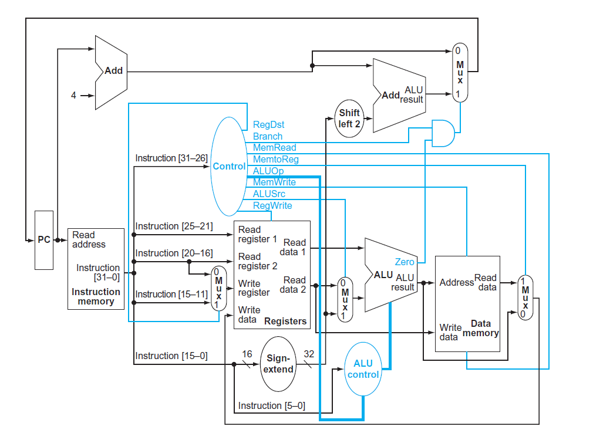

En el artículo anterior vimos como cualquier instrucción de MIPS puede representarse con un número. Un número binario de 32 bits que en definitiva no es más que una señal eléctrica digital. La CPU de MIPS debe utilizar esa señal para ejecutar las instrucciones de un programa en el _hardware_.

Como dijimos anteriormente una CPU tiene tres partes: la unidad de control, los registros y la ALU. Estas dos últimas forman lo que se conoce como el _datapath_. En este artículo vemos como podemos implementar este _datapath_, cuáles son sus partes constituyentes y como funcionan en conjunto. La implementación de la unidad de control la dejamos para el próximo artículo.

Hay que aclarar que esta implementación del _datapath_ de MIPS ejecuta cada instrucción en un ciclo de reloj pero no usa _pipelining_. Esta técnica, el _pipelining_, sirve para mejorar sustancialmente el rendimiento de la CPU y es lo que usa una CPU **real** de MIPS. El _datapath_ real de MIPS usa una tubería o _pipeline_ de cinco etapas que desarrollaremos en otro artículo.

El circuito de Logisim de este _datapath_ simple pueden encontrarlo en [GitHub](https://github.com/santiagotrini/mips-datapath).

## Unidades funcionales

Para ilustrar el _datapath_ de MIPS vamos a concentrarnos en un subconjunto de las instrucciones. Nos interesan las siguientes instrucciones:

- Instrucciones de referencia a memoria: _load word_ y _store word_.
- Instrucciones lógicas y aritméticas: _add_, _sub_, _and_ y _or_.
- Instrucciones de saltos: _branch on equal_ y _jump_.

Si bien es un subconjunto reducido sirve perfectamente para mostrar las unidades funcionales de la CPU de MIPS. Además representan los tres tipos de instrucciones, R, I y J.

En primer lugar tenemos que preguntarnos que necesitamos para ejecutar estas instrucciones. Para todas las instrucciones necesitamos una **memoria** que las contenga y un registro con la dirección de la próxima instrucción a ejecutar. Este registro es el que tradicionalmente llamamos **PC** por _program counter_. En el primer paso del ciclo de instrucción entonces leemos una memoria con instrucciones usando el valor del PC.

Los próximos pasos dependen de la instrucción en cuestión, pero salvo para _jump_ en todas tenemos que usar entre dos y tres registros.

```
# instrucciones de tipo R usan tres registros
add   $t1, $t2, $t3
sub   $t3, $t3, $a0
and   $s1, $zero, $a1
# instrucciones de tipo I usan dos registros
beq   $zero, $t4, exit      
lw    $t1, 4($t0)
```

Por este motivo tenemos un **archivo de registros**, que no es más que un circuito con los 32 registros enteros de MIPS, desde `$zero` hasta `$ra`. El archivo de registros nos permite leer dos registros y escribir en un tercer registro. Para especificar un registro bastan cinco bits porque $2^5=32$.

Para las instrucciones aritméticas y lógicas está claro que necesitamos una **ALU** que realice las operaciones. Si miramos con atención la sintaxis de `lw` y `sw` vemos que hay una suma también en esas instrucciones. Porque la dirección de memoria sobre la que leemos o escribimos se calcula sumando una dirección base más un _offset_. Incluso en el _branch on equal_ tenemos que utilizar la ALU, porque una manera muy simple de comparar dos registros para ver si son iguales es restándolos y viendo si el resultado es cero. Por este motivo la ALU de MIPS tiene una salida de 1 bit que nos indica si el resultado de la operación dió cero. Este tipo de señales dentro de una CPU se conocen como _flags_.

Por último tenemos para las instrucciones de acceso a memoria la **memoria de datos**, tanto para leer en `lw` como para escribir en `sw`. Conectando estas unidades funcionales tenemos distintos grupos de cables llamados **buses**. La mayor parte de ellos son de 32 bits de ancho ya que tanto las instrucciones como los datos con los que opera MIPS son de 32 bits.

El manual de Patterson y Hennessy ilustra muy bien las partes del _datapath_ de MIPS y sus conexiones con el siguiente diagrama.

{:.zoom}

Salvo que se aclare en el diagrama los buses que conectan las distintas partes de la CPU son de 32 bits. Las líneas azules representan señales de control, todas de 1 bit de ancho salvo las que sirven para controlar la ALU.

En general los datos (señales digitales) que viajan por los buses lo hacen de izquierda a derecha.

## Los multiplexores

En el diagrama de arriba se aprecian varios multiplexores. Estos están ahí porque existe una asimetría entre entradas y salidas. Por ejemplo si yo quiero que el resultado de la ALU vaya a parar al archivo de registros para el caso de un `add` o a la dirección de la memoria de datos para un `lw` no hay problema. Simplemente divido el bus en dos y listo.

El problema se presenta cuando yo quiero que dos señales potencialmente diferentes vayan a la misma entrada. Por ejemplo para un `add` como dijimos queremos que el resultado vaya a la entrada etiquetada como _Write data_ en el archivo de registros. Pero para un `lw` necesitamos que _Write data_ en el archivo de registros reciba la salida _Read data_ de la memoria de datos. Seguramente estos dos buses de 32 bits llevan distintas secuencias de unos y ceros. ¿Qué es lo que va a ver el archivo de registros en _Write data_ si estas señales llegan las dos juntas al mismo tiempo?

Para evitar esto usamos multiplexores en estos casos, y la unidad de control elige con estos multiplexores cuál señal pasa y cuál se queda. Existen cuatro casos. En el que mencionamos arriba usamos la señal `MemToReg`. El segundo caso para diferenciar entre una instrucción de tipo I y una de tipo R con `RegDst`. El tercero para elegir el segundo operando de la ALU, entre un registro o una constante o valor inmediato con `ALUSrc`. Y el cuarto caso es para elegir el próximo valor del PC. O bien el valor actual más cuatro para la próxima instrucción cuando nuestro programa se ejecuta secuencialmente, o bien el _branch target_, es decir, la dirección de memoria a la que apunta un `beq` cuando se cumple la condición. Este multiplexor está controlado por la señal llamada `Branch`.

## La próxima instrucción

Para la gran mayoría de las instrucciones de MIPS el PC tiene que incrementar en cuatro su valor para apuntar a la próxima instrucción del programa. Para eso está el sumador que está arriba a la izquierda. Este sumador tiene como entradas el valor actual del PC y el número cuatro.

Pero para las instrucciones `beq` y `j` el valor del PC tiene que ser distinto. En el caso de `beq` solo si los dos registros que se comparan son iguales hay que sumar al PC el valor de los primeros 16 bits de la instrucción extendidos a 32 bits y desplazados 2 bits a la izquierda. Eso es lo que se ve en la esquina superior derecha del diagrama.

El caso de _jump_ no aparece en el diagrama de arriba pero si está implementado en el circuito de Logisim. El cálculo de la dirección es un poco más complicado en este caso. Lo que la CPU hace es usar los primeros 26 bits de la instrucción, desplazarlo dos bits a la izquierda para obtener 28 bits y concatenarlo con los últimos 4 bits del PC para obtener una dirección de 32 bits.

## Un ejemplo

Consideremos la siguiente instrucción

```
lw $s7, 8($s0)
# usando los nombres numéricos de los registros es
lw $23, 8($16)
```

La instrucción _load word_ es un buen ejemplo para ilustrar el funcionamiento del _datapath_ porque hace uso de todas las unidades funcionales.

En primer lugar consideremos la codificación de esta instrucción como un número.

| _Hex_  | _op_ | _rs_| _rt_|       _imm_       |
|:------:|:----:|:---:|:---:|:-----------------:|
|8e170008|100011|10000|10111|0000 0000 0000 1000|

Los pasos que sigue la instrucción son los siguientes:

1. Poner el valor actual del PC en la entrada _Read address_ de la memoria de instrucciones.
2. La salida _Instruction_ de la memoria de instrucciones contiene los 32 bits detallados en la tabla de arriba. Los bits 31 a 26 son el _opcode_ y son entrada de la unidad de control. Cuando la unidad de control ve el número `0x23` sabe que estamos ejecutando un `lw` y setea las señales de control necesarias como `RegWrite` o `MemRead`.
3. Los bits 25 a 21 y 20 a 16 son _rs_ y _rt_. El primero es el registro a leer, o sea `$16` o `$s0` que es lo mismo. La dirección base para el _load word_. Está conectado a _Read register 1_ en el archivo de registros. Los bits 20 a 16 van conectados a través de un multiplexor a _Write register_ en el archivo de registros. Le indican que hay que escribir en `$23`. El archivo de registros utiliza números de 5 bits para seleccionar hasta dos registros para lectura y uno para escritura. La salida `Read data 1` del archivo de registros ahora contiene el valor de `$s0`, supongamos que es `0x10010000`.
4. El contenido de `$s0` o `0x10010000` sirve ahora de entrada a la ALU. La otra entrada de la ALU viene de los bits 0 a 15 (el campo _imm_) de la instrucción que previamente pasan por un extensor de bits (_sign extend_ en el diagrama). Esto es necesario porque los operandos de la ALU deben tener el mismo ancho de bits, en este caso 32. La unidad de control setea las líneas de control de la ALU para que realice una suma. El resultado de `0x10010000` + `0x00000008` es la salida _Result_ de la ALU.
5. La entrada _Read address_ de la memoria de datos recibe la salida de la ALU que le indica la dirección de memoria a leer. La salida _Read data_ ahora tiene el contenido de la dirección `0x10010008`, supongamos que es el número 32 o `0x00000020`. Este número pasa por el multiplexor y viaja hacia atrás en el diagrama de nuevo al archivo de registros. Esto se conoce como _write back_.
6. Por último el número `0x00000020` entra en _Write data_ en el archivo de registros y se guarda en el registro apuntado en _Write register_ (que era `$23`). La instrucción _load word_ está completa.

## El reloj

Todo esto sucede en un ciclo de reloj. Un _datapath_ no es más que una serie de circuitos secuenciales o de memoria con lógica combinacional en el medio. Los elementos de memoria actualizan su valor en alguno de los flancos del reloj ya que están formados por _flip flops_. Por lo tanto podemos decir que el reloj le marca el ritmo de operación a la CPU. Cada ciclo de reloj está marcando un nuevo ciclo de instrucción.

El ciclo de reloj tiene que ser lo suficientemente extenso para darle tiempo a las señales eléctricas de propagarse a través de los circuitos y buses y completar su camino. Por supuesto que hablamos de tiempos muy pequeños. Para darnos una idea una compuerta NAND de tecnología CMOS como la que pueden encontrar en el integrado 74HC00 ronda los 20 nanosegundos o $20 \times 10^{-9}$. Esto es lo que se conoce como _delay_ de propagación. Los cables también introducen un _delay_ pero mucho menor, alrededor de 1 ns cada 15 cm. Si el diseño del _datapath_ es simple y eficiente nos permite alcanzar frecuencias de reloj (cantidad de ciclos por segundo) más altas, lo que se traduce directamente en más instrucciones por segundo.

Una medida de que tan rápido funciona una CPU son las MIPS (nada que ver con la arquitectura MIPS), que significa millones de instrucciones por segundo. Un reloj con una frecuencia de 1 MHz (1 millón de ciclos por segundo) en este _datapath_ ejecuta 1 millón de instrucciones por segundo o 1 MIPS. Esto siempre y cuando todas las instrucciones se ejecuten completamente en un ciclo de reloj, que es el caso para esta CPU pero no es necesariamente así siempre. Pueden ver la tabla de [este artículo de Wikipedia](https://en.wikipedia.org/wiki/Instructions_per_second) que compara distintas CPU a lo largo de la historia indicando MIPS e IPC (instrucciones por ciclo de reloj).

## Conclusión

Vimos como los distintos bloques de lógica secuencial y combinacional interactúan para formar un _datapath_. En general el esquema es tener elementos de memoria unidos por bloques combinacionales que modifican los valores almacenados de algún modo.

El _datapath_ presentado aquí no es el que podemos encontrar en el _hardware_ real de una CPU MIPS de 32 bits. Es más una simplificación con fines educativos, aunque fiel en la idea general a una implementación real de MIPS.

Quedan pendiente para los próximos artículos ver como diseñar una unidad de control para este _datapath_ y como aumentar el rendimiento de esta CPU usando la técnica de _pipelining_ que es prácticamente universal para cualquier procesador.
