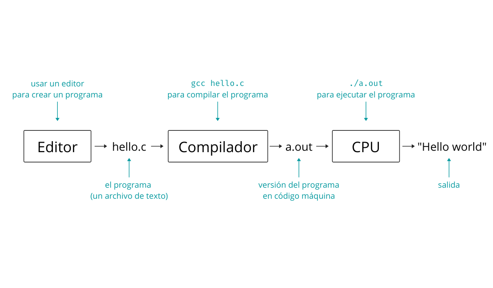
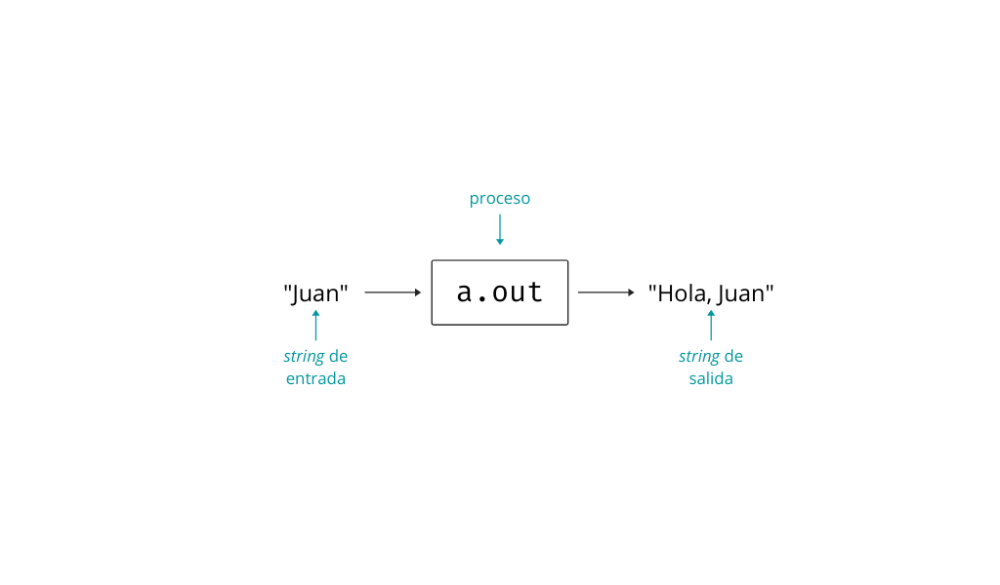

El objetivo del siguiente artículo es introducirlos a la programación en [C](https://es.wikipedia.org/wiki/C_(lenguaje_de_programaci%C3%B3n)). Vamos a ver paso a paso como escribir un par de programas sencillos y ejecutarlos en nuestra computadora.

Para esto van a necesitar un editor de texto, la CLI de su sistema operativo y un compilador de C. Si están haciendo esto desde Linux ya tienen todo lo necesario seguramente. Para acceder a la terminal en Linux pueden tipear `Ctrl + Alt + T`. En Windows busquen "cmd" en el menú de inicio.

Mis recomendaciones de editores de texto:
- [Atom](https://atom.io)
- [VSCode](https://code.visualstudio.com)
- [Sublime Text](https://sublimetext.com)
- [Vim](https://vim.org)

Como compilador de C usamos `gcc`. En Linux es casi imposible no encontrarlo instalado por defecto. En Windows podemos instalar [MinGW](https://sourceforge.net/projects/mingw/). Para chequear que lo tenemos instalado podemos escribir en la terminal o CLI lo siguiente.

```console
$ gcc --version
```

Aclaración, el signo `$` no se escribe, es para indicar que estamos en la línea de comandos. Si vemos el número de versión de `gcc` estamos listos.

## Programar en C

La tarea de programar, en este caso en el lenguaje C, consiste en tres pasos.
- Crear un programa.
- Compilarlo.
- Ejecutar el programa.

En el paso número uno usamos un editor de texto para crear un archivo de código fuente (_source code_). En general el archivo tiene extensión `.c` como en `hola.c`. El resultado de este paso es un archivo de código.

El segundo paso consiste en usar `gcc` (el compilador) para crear un archivo ejecutable. El trabajo del compilador es traducir nuestro código de C en código máquina, es decir el código que entiende la CPU de nuestra computadora. En la mayoría de los casos compilar quiere decir tipear lo siguiente en la terminal.

```console
$ gcc mi_programa.c
```

El resultado del segundo paso es un archivo ejecutable, por defecto llamado `a.out` en Linux o `a.exe` en Windows si usamos `gcc` como compilador.

El tercer paso es ejecutar el programa y ver el resultado. Los programas que vamos a estar realizando funcionan en la CLI. Al tipear el nombre del programa y darle al `Enter` lo que sucede es que el sistema operativo otorga el control de la CPU a nuestro programa. La CPU ejecuta las instrucciones del mismo y al terminar le devuelve el control al sistema operativo.

{:.zoom}

## Hello world

La tradición desde la década de 1970 dicta que un programador principiante tiene que escribir como su primer programa uno que ponga en la pantalla la frase "Hello world". Este programa no es muy interesante, pero sirve para chequear que tengamos todo funcionando de manera correcta.
Además nos sirve como plantilla para los programas que vamos a ir escribiendo a medida que avancemos.

El código es como sigue.

```c
// hello.c
#include <stdio.h>

int main(void) {
  printf("Hello world\n");
  return 0;
}
```

Copien este texto y peguenlo en un archivo llamado `hello.c`. Luego tenemos que compilarlo y ejecutarlo. En la línea de comandos tenemos que estar parados en la ubicación de nuestro archivo de código y tipear lo siguiente.

```console
$ gcc hello.c
$ ./a.out
Hello world
```

O si lo están haciendo en Windows.

```console
$ gcc hello.c
$ a.exe
Hello world
```

Ahora volvamos un momento al código fuente para ver que es lo que escribimos.
La primera línea es un comentario, es decir, texto que el compilador va a ignorar. Son aclaraciones que escribimos para que las lean los humanos, ya sea nosotros u otros programadores. Hay dos formas de escribir comentarios en C.

```c
// esto es un comentario de una línea

/*
Esto es un comentario
que puede ocupar
varias líneas
*/
```

En segundo lugar aparece la directiva `#include <stdio.h>`. Estas líneas que empiezan con `#` son directivas para el preprocesador de C. El preprocesador de C, como su nombre lo indica, se ejecuta justo antes del proceso de compilación. En este caso lo que hace es incluir los contenidos del archivo `stdio.h` en nuestro código. El archivo `stdio.h` es lo que se conoce como _header file_ y es parte de la [librería estándar de C](https://es.wikipedia.org/wiki/Biblioteca_est%C3%A1ndar_de_C). En este caso `stdio` quiere decir entrada y salida estándar. Es lo que nos permite usar la función `printf()` más abajo.

Luego tenemos la declaración de la función `main()`.

```c
int main(void) {
  printf("Hello world\n");  // nuestro código arranca acá
  return 0;
}
```

Más adelante vamos a estudiar funciones en profundidad, por ahora basta con saber que lo que está entre las llaves de `main()` es lo que se ejecuta. De arriba hacia abajo. Y que la última línea debe ser `return 0;`.

En definitiva nuestro programa es la línea `printf("Hello world\n");`. Esto es una llamada a la función `printf()` con argumento `"Hello world\n"`. El argumento de `printf()` es una cadena de texto o _string_ que es lo que se va a mostrar en pantalla. El `\n` simplemente es el carácter de nueva línea, equivale a presionar `Enter` en el teclado.

Noten que las dos líneas que están dentro de las llaves de `main()` terminan en `;`. Estas líneas que terminan en `;` son **enunciados**. Un programa es un conjunto de enunciados.

## Errores

¿Qué puede salir mal? En primer lugar si no respetamos la **sintaxis** de C el compilador nos va a dar algún error o advertencia. Si el compilador se queja de algo estamos ante un **error en tiempo de compilación**. Lo más probable es que tipeamos mal en ese caso.

Pero en otros casos el compilador no nos dice nada y al ejecutar nuestro programa no funciona como pretendíamos. Esos son **errores en tiempo de ejecución** y son mucho más difíciles de diagnosticar y arreglar. Estos errores también se conocen como _bugs_.

## Usando argumentos

Como segundo y último ejemplo vemos un programa que acepte **argumentos** en la línea de comandos. Para eso hay que definir la función `main()` de otra manera.
El código completo es el siguiente.

```c
// args.c
#include <stdio.h>

int main(int argc, char *argv[]) {
  printf("Hola, %s\n", argv[1]);
  return 0;
}
```

Ponemos lo de arriba en un archivo llamado `args.c`, compilamos y ejecutamos de la siguiente manera.

```console
$ gcc args.c
$ ./a.out Juan
Hola, Juan
```

En este programa "Juan" es un argumento, prueben reemplazarlo por otro texto. Es importante que el texto no contenga espacios porque se usan para delimitar un argumento de otro y nuestro programa solo lee un argumento.

Repasemos el código. Las dos primeras líneas no introducen novedades. En la cuarta línea vemos la definición de `main()` con argumentos. El primer argumento `int argc` significa _argument count_ (cantidad de argumentos) y el segundo `char *argv[]` es el _argument vector_ (vector de argumentos).

En el vector de argumentos podemos acceder a los argumentos que se le pasen al programa por la CLI. En `argv[0]` tenemos el nombre del programa, en `argv[1]` el primer argumento, en `argv[2]` el segundo y así.

En la quinta línea de código tenemos de nuevo a `printf()`, pero esta vez aparece un `%s`. La función `printf()` reemplaza el `%s` por el valor de `argv[1]` (que aparece después de una coma en esa línea). Luego el programa termina con `return 0;` como el anterior.

## Entrada y salida

En general un programa es provisto de datos de entrada, los procesa y produce datos de salida. La manera más simple tal vez de hacer esto es como hicimos en el programa anterior. Los datos de entrada son argumentos en la línea de comandos ("Juan" en este caso) y la salida el _string_ "Hola, Juan".

El programa anterior no parece muy interesante, pero ilustra a la perfección un modelo de programación donde pensamos que un programa no es más que un mecanismo que lee datos, hace algo y escribe datos a su salida. De hecho el compilador `gcc`, que es un programa bastante complicado, hace lo mismo. Cuando escribimos `gcc args.c` la entrada es el nombre del archivo que `gcc` va a leer y la salida es `a.out` que en definitiva es un archivo con una secuencia distinta de _bytes_ o caracteres (el programa compilado y listo para ejecutar).

{:.zoom}
