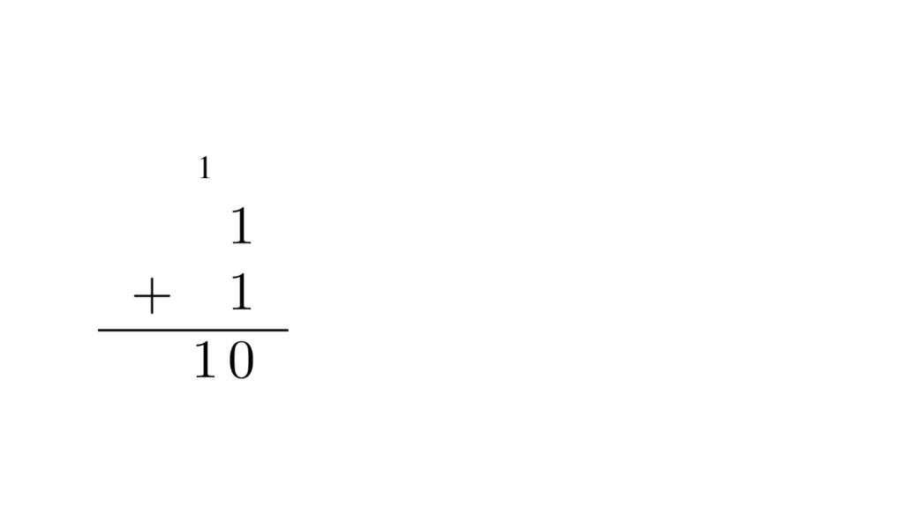

Un resumen de lo más importante sobre compuertas lógicas y circuitos digitales. Lo mínimo indispensable sobre circuitos combinacionales y secuenciales para hablar de microarquitecturas de computadoras.

# Contenidos
{:.no_toc}

1. Generated ToC
{:toc}  

## Introducción

Vimos que para entender como funciona en conjunto el _hardware_ y el _software_ que componen una computadora era conveniente dividir el sistema entero en capas, desde el nivel 6 formado por las aplicaciones que el usuario utiliza día a día hasta el nivel 0 de la lógica digital, compuesto integramente por compuertas lógicas y cables.

En realidad ni el _software_ del usuario, ni las compuertas lógicas son cosas físicas y tangibles. En última instancia una computadora es en gran medida un montón de transistores. Los transistores sí los podemos tocar, pero sí tenemos que hablar del funcionamiento de una computadora entera en términos del funcionamiento de un circuito electrónico con millones o billones de transistores la cosa se complica bastante.

{:.zoom}
*Un transistor de unión bipolar en encapsulado TO-92, al lado el símbolo electrónico.*

El estudio del funcionamiento de los transistores y los circuitos que podemos formar con ellos es parte de la **electrónica** y si tenemos que ubicarlos en nuestra jerarquía de niveles o capas de abstracción tendrían que estar en el nivel -1.

Pero nosotros al estudiar computación, así como los electrónicos, estudiamos unos elementos llamados **compuertas lógicas** que están formados por un puñado de transistores. Estos elementos, las compuertas, forman también circuitos pero con la ventaja de que podemos estudiar estos circuitos sin pensar en voltajes o corrientes y centrarnos únicamente en el resultado que producen dependiendo de su señal de entrada. Pensamos los circuitos digitales de compuertas lógicas puramente como funciones **booleanas**. Es decir, como funciones matemáticas de una o más entradas y una o más salidas sobre el conjunto de dos valores: 1 y 0.

{:.zoom}
*Una compuerta NAND hecha con transistores y resistencias (muy simplificada). Tiene dos entradas A y B y una salida Q.*

## Compuertas lógicas

Existe un número pequeño de compuertas lógicas, siendo las más comunes las compuertas AND, OR y NOT. A cada compuerta le damos un símbolo para representarlas en los circuitos. Y las líneas representan "cables" que llevan una señal de una compuerta a otra del circuito. Usamos letras mayúsculas como nombres de variables que representan entradas o salidas de nuestros circuitos. La salida de una compuerta la podemos escribir como función de sus entradas en una ecuación.

### AND

La compuerta AND también llamada "y" lógico, conjunción o producto lógico produce un 1 únicamente cuando todas sus entradas son 1. Caso contrario el resultado es 0.

{:.zoom}
*Símbolo de la compuerta AND.*

|$A$  | $B$ | $Q = AB$|
|:---:|:---:|:-------:|   
| 0   | 0   |       0 |  
| 0   | 1   |       0 |
| 1   | 0   |       0 |
| 1   | 1   |       1 |

### OR

La compuerta OR también llamada "o" lógico, disyunción o suma lógica produce un 0 únicamente cuando todas sus entradas son 0. Caso contrario el resultado es 1.

{:.zoom}
*Símbolo de la compuerta OR.*

|$A$  | $B$ |$Q = A+B$|
|:---:|:---:|:-------:|   
| 0   | 0   |       0 |  
| 0   | 1   |       1 |
| 1   | 0   |       1 |
| 1   | 1   |       1 |

### NOT

A diferencia de las dos compuertas anteriores, la compuerta NOT tiene una sola entrada, es decir, es un operador unario mientras que las demás son operadores binarios. La negación hace justamente lo que uno espera, invierte la señal que recibe, 1 por 0 y 0 por 1.

{:.zoom}
*Símbolo de la compuerta NOT.*

|$A$  | $\overline{A}$ |  
|:---:|:--------------:|
|0    | 1              |
|1    | 0              |

### XOR

La compuerta XOR también llamado "o" exclusivo da como resultado 1 cuando sus dos entradas son distintas y 0 cuando sus dos entradas son iguales.

{:.zoom}
*Símbolo de la compuerta XOR.*

|$A$  | $B$ |$Q = A\oplus B$|
|:---:|:---:|:-------:|   
| 0   | 0   |       0 |  
| 0   | 1   |       1 |
| 1   | 0   |       1 |
| 1   | 1   |       0 |

### NAND

La compuerta NAND es una de las dos compuertas universales. Uno de los resultados del Álgebra de Boole es que toda función booleana puede representarse mediante las tres compuertas usuales: AND, OR y NOT. Un resultado aún más interesante es que esas tres compuertas pueden construirse con solamente compuertas NAND (y también NOR). Así que cualquier circuito lógico se puede construir únicamente con compuertas NAND.

Como su nombre lo indica, NAND o NOT AND es el resultado de negar la salida de una compuerta AND.

{:.zoom}
*Símbolo de la compuerta NAND.*

|$A$  | $B$ |$Q = \overline{AB}$|
|:---:|:---:|:-------:|   
| 0   | 0   |       1 |  
| 0   | 1   |       1 |
| 1   | 0   |       1 |
| 1   | 1   |       0 |

### NOR

La otra compuerta universal junto con NAND. Es el resultado de negar la salida de una compuerta OR. Noten que las burbujas en los símbolos indican negación.

{:.zoom}
*Símbolo de la compuerta NOR.*

|$A$  | $B$ |$Q = \overline{A+B}$|
|:---:|:---:|:-------:|   
| 0   | 0   |       1 |  
| 0   | 1   |       0 |
| 1   | 0   |       0 |
| 1   | 1   |       0 |

### Tablas de verdad

El funcionamiento de cada compuerta está dado por su tabla de verdad. Esta tabla nos indica la salida de la compuerta para cada combinación de entradas posible. Como la lógica binaria es parte de la matemática discreta, es decir el conjunto de valores en estas operaciones es finito (puede ser únicamente 1 o 0), esto nos permite armar una tabla con todas las combinaciones posibles. En general para una función booleana de $n$ variables tenemos una tabla de $2^n$ filas.

Podemos por ejemplo armar la tabla de verdad del AND de 3 entradas: $Q = ABC$. Se los dejo como ejercicio. Lo importante es cubrir todas las combinaciones posibles. Más allá de cuántas entradas tenga una compuerta o una función cualquiera implementada en algún circuito hay un límite. Podría decirles que el AND de 10 entradas se comporta igual que el de 2 entradas, da 1 únicamente cuando todas sus entradas son 1. O podría armar una tabla de 1024 filas para mostrarles todas las combinaciones posibles. Queda claro que a veces la tabla de verdad no es el enfoque adecuado.

Los circuitos lógicos formados por compuertas también pueden describirse por medio de tablas de verdad. Por ejemplo el siguiente circuito sirve para comparar dos números de dos bits y ver si son iguales.

{:.zoom}

Los números son $A$ y $B$ cada uno de dos bits: $A_1$ y $A_0$ por ejemplo. Y la salida $Q$ da 1 si $A$ y $B$ son el mismo número únicamente.

## Circuitos combinacionales

Toda función lógica que pueda ser expresada mediante una tabla de verdad puede ser implementada como un circuito combinacional. Un circuito combinacional es un circuito donde sus salidas dependen únicamente del valor de sus entradas. Los circuitos que no son combinacionales se llaman circuitos secuenciales y los veremos en la próxima sección.

La ventaja de poder determinar una función booleana solo teniendo su tabla es que tenemos una forma directa de encontrar el circuito y su expresión algebraica. La **forma normal disyuntiva** de una función booleana es una forma de expresar una función cualquiera como suma de productos lógicos. Para eso tenemos que tomar las filas de la tabla de verdad donde hay unos. Esas filas forman los llamados **mintérminos** que son el producto de las variables de la función. Si la variable vale 1 en esa fila se pone como está, si vale 0 se pone negada. Luego se suman todos los mintérminos y tenemos la expresión algebraica de la función. Damos un ejemplo con tres variables.

|$A$  | $B$ | $C$ | $ Q = \bar{A}\bar{B}\bar{C} + \bar{A}BC + A\bar{B}C$  |
|:---:|:---:|:---:|:-----------------------------------------------------:|
|  0  | 0   | 0   |                                                     1 |
|  0  | 0   | 1   |                                                     0 |
|  0  | 1   | 0   |                                                     0 |
|  0  | 1   | 1   |                                                     1 |
|  1  | 0   | 0   |                                                     0 |
|  1  | 0   | 1   |                                                     1 |
|  1  | 1   | 0   |                                                     0 |
|  1  | 1   | 1   |                                                     0 |

{:.zoom}

Y otro ejemplo más pero con dos variables ahora. El circuito de este último ejemplo es equivalente a la compuerta XOR.

|$A$  | $B$ | $ Q = \bar{A}B + A\bar{B}$|
|:---:|:---:|:-------------------------:|
|0    | 0   |                          0|
|0    | 1   |                          1|
|1    | 0   |                          1|
|1    | 1   |                          0|

{:.zoom}

Siempre podemos recurrir a la forma normal disyuntiva para encontrar un circuito que haga lo que buscamos, aunque no siempre es la mejor opción como muestra el último ejemplo que bien podría hacerse con una sola compuerta XOR.

En las próximas secciones veremos algunos circuitos combinacionales que son de gran utilidad para diseñar una computadora.

### Multiplexores

Un multiplexor es un circuito que funciona como selector de varias entradas posibles a una única salida. Por ejemplo si tengo dos entradas posibles $A$ y $B$ el multiplexor me permite elegir como salida o bien $A$ o bien $B$. Para saber cuál de las entradas va a la salida necesita de líneas de control. Para un multiplexor 2:1 (de dos entradas) se necesita una línea de control. Para un multiplexor 4:1 (de cuatro entradas) se necesitan dos líneas de control. Y en general para un multiplexor de $2^n$ entradas se necesitan $n$ líneas de control. Les dejo como ejemplo el circuito y la tabla del multiplexor 2:1. En la tabla $S$ es la línea de control que elige entre $A$ y $B$.

|$A$  | $B$ | $S$ | $Q$ |
|:---:|:---:|:---:|:---:|
|0 | 0 | 0 | 0 |
|0 | 0 | 1 | 0 |
|0 | 1 | 0 | 0 |
|0 | 1 | 1 | 1 |
|1 | 0 | 0 | 1 |
|1 | 0 | 1 | 0 |
|1 | 1 | 0 | 1 |
|1 | 1 | 1 | 1 |

{:.zoom}

Si miramos atentamente el circuito nos damos cuenta que el AND de arriba, el que está conectado a $A$ sólo puede dar algo distinto de 0 cuando $S$ vale 0. Recíprocamente el AND de abajo, conectado a $B$ sólo puede dar uno cuando $S$ vale 1. El multiplexor funciona eligiendo entre $A$ y $B$ según el valor de $S$. Podemos dar una tabla de verdad resumida que muestra el funcionamiento del multiplexor teniendo en cuenta solamente como entrada la línea de control.

|$S$ | $Q = A\bar{S} + BS$  |
|:---:|:---:|
|0 | $A$ |
|1 | $B$ |

### Decodificadores

Un decodificador es un circuito de varias entradas y varias salidas. En general un decodificador de $n$ entradas tiene $2^n$ salidas. Para entender su funcionamiento veamos la tabla del decodificador 2:4 (dos entradas, cuatro salidas).

|$D_1$ | $D_0$ | $Q_3$ | $Q_1$ | $Q_1$ | $Q_0$  |
|0 | 0 | 0 | 0 | 0 | 1 |
|0 | 1 | 0 | 0 | 1 | 0 |
|1 | 0 | 0 | 1 | 0 | 0 |
|1 | 1 | 1 | 0 | 0 | 0 |

Esta tabla sí es una tabla de verdad completa. Hay dos variables de entrada llamadas $D_0$ y $D_1$ así que tenemos 4 filas. Para cada salida del circuito o función necesitamos una columna. Nótese que las dos entradas tienen la misma letra con distinto subíndice a propósito. Podemos pensar que están codificando los números del 0 al 3 en binario. No nos sorprende entonces que un decodificador sólo pone un 1 en la salida correspondiente al número representado por sus entradas.

Podemos construir decodificadores 3:8, 4:16, etcétera. El circuito se los dejo como ejercicio.

### Sumadores

Consideren la siguiente tabla.

|$A$ | $B$ | $S$ | $C_\text{out}$   |
|:---:|:---:|:---:|:---:|
|0 | 0 | 0 | 0 |
|0 | 1 | 1 | 0 |
|1 | 0 | 1 | 0 |
|1 | 1 | 0 | 1 |

$A$ y $B$ son dos números (1 bit cada uno). $S$ es la suma aritmética (no lógica) de $A$ y $B$. $C_\text{out}$ viene de _carry out_ y significa "acarreo de salida". Esta función de dos entradas y dos salidas suma números. Si sumo $1 + 1 = 2$ ese dos en binario es 10, osea 0 en la "unidad" y 1 que me llevo a la "decena" o acarreo. Por supuesto que unidades, decenas y centenas no tienen sentido acá porque estamos en base 2, pero la idea es la misma. Estamos sumando como lo hacíamos en la primaria, columna por columna.

{:.zoom}

Viendo la tabla nos damos cuenta que la columna que corresponde a la suma es una compuerta XOR y la del acarreo es un AND. Este circuito se llama _half adder_, o sea es la mitad de un sumador.

{:.zoom}

Este circuito está muy bien hasta que queremos sumar números de más de un bit. Como la siguiente suma en binario de 3 y 7.

{:.zoom}

Ahí nos damos cuenta de que lo que para la primer columna es acarreo de salida o _carry out_ para la segunda columna es acarreo de entrada (_carry in_). Así que un sumador completo (_full adder_) tiene que tener tres entradas. Hay que agregar el _carry in_ y lo hacemos en la siguiente tabla.

|$A$ | $B$ | $C_\text{in}$ | $S$ | $C_\text{out}$   |
|:---:|:---:|:---:|:---:|:---:|    
|0 | 0 | 0 | 0 | 0 |
|0 | 0 | 1 | 1 | 0 |
|0 | 1 | 0 | 1 | 0 |
|0 | 1 | 1 | 0 | 1 |
|1 | 0 | 0 | 1 | 0 |
|1 | 0 | 1 | 0 | 1 |
|1 | 1 | 0 | 0 | 1 |
|1 | 1 | 1 | 1 | 1 |

Les dejo como ejercicio dibujar el circuito. Existen algunas mejoras que se pueden hacer a estos circuitos para sumar un poco más rápido, pero en esencia así suman números las computadoras, como un chico de 6 años, sólo que mucho más rápido.

Tengan en cuenta que quién puede sumar puede restar porque $A - B = A + (-B)$. Les dejo como ejercicio encontrar un circuito para restar números.

## Circuitos secuenciales

Todos los circuitos vistos hasta ahora pueden representarse por una tabla de verdad, incluso aunque no lo hagamos porque no sea práctico. Existen otros circuitos donde esto no es posible, es decir sus salidas no dependen enteramente de sus entradas.

Sus salidas dependen del valor de sus entradas pero también de valores anteriores de sus propias salidas. Decimos que estos circuitos tienen **estado** y los llamamos circuitos secuenciales. La manera en la que logramos que un circuito lógico tenga un estado es agregando **ciclos de retroalimentación** en el circuito y estos ciclos son el componente fundamental para formar dispositivos de memoria.

### Latches

El circuito secuencial útil más básico que podemos estudiar es el **latch SR**. La "S" es por _set_ y la "R" por _reset_. Este circuito lo podemos describir mediante su **tabla característica**, es decir, el análogo a la tabla de verdad para circuitos secuenciales.

|$S$ | $R$ | $Q_{n}$  |
|:---:|:---:|:---:|
|0 | 0 | $Q_{n-1}$ |
|0 | 1 | 0 |
|1 | 0 | 1 |
|1 | 1 | X |

Un par de aclaraciones. La salida $Q$ cuando $S$ y $R$ valen 1 es indeterminada. Por eso la "X". Esto no significa que no valdrá ni uno ni cero. En un circuito real tomará alguno de los dos valores pero no podremos determinar cuál de los dos. En el caso en el que sus entradas valen cero, la salida $Q$ vale lo mismo que valía en el instante de tiempo anterior, de ahí el $Q_{n-1}$ en la tabla. Piensen en ese subíndice $n$ como indicando un instante de tiempo. Este circuito se puede construir con compuertas NAND o NOR, les dejo el circuito con NOR.

{:.zoom}

Existen otros tipos de latches, pero todos basados en las dos compuertas NOR o NAND retroalimentadas del _latch_ SR.

Un agregado interesante que le podemos hacer a este circuito es una entrada de _enable_ que habilita o deshabilita el funcionamiento del circuito, sin modificar el valor que ya está almacenado. El siguiente circuito es un **latch de tipo D con enable** y es importante entender como funciona.

{:.zoom}

La tabla característica de este _latch_ muestra que a diferencia del circuito anterior, usando una compuerta NOT no tenemos más el problema de que $S$ y $R$ sean uno a la vez, y ahora tenemos una sola entrada llamada $D$ por _data_. Además el circuito solo puede cambiar de estado cuando $E$ vale uno, es decir cuando está habilitado.

|$E$ | $D$ | $Q_n$  |
|:---:|:---:|:---:|
|0 | 0 | $Q_{n-1}$ |
|0 | 1 | $Q_{n-1}$ |
|1 | 0 | 0 |
|1 | 1 | 1 |

A menudo encontramos que la entrada de _enable_ se reemplaza por una señal de reloj periódica (_clock_ en inglés como aparece en la gran mayoría de los diagramas). En ese caso el _latch_ tiene la posibilidad de cambiar de estado en la mitad activa del ciclo de reloj. Esto último quedará más claro cuando comparemos los _latches_ con los _flip flops_.

### Flip flops

Los _latches_ son muy básicos, en los circuitos que forman las memorias dentros de las computadoras en general encontramos _flip flops_. Un _flip flop_ es un circuito similar al _latch_ pero que es **activado por flanco**.

Para entender que quiere decir esto conviene estudiar los diagramas de tiempo de un _flip flop_ tipo D y un _latch_ con _enable_ tipo D.

{:.zoom}

En el diagrama de tiempo se muestra una señal digital periódica (_clock_) que oscila entre 1 y 0. La señal $D$ corresponde a la entrada tanto del _latch_ tipo D como del _flip flop_ tipo D. El _latch_ toma el valor de $D$ sea cero o uno durante todo el pulso alto de la señal de reloj, eso es lo que vale su salida $Q$. En cambio el _flip flop_ solo cambia su estado en los flancos positivos del reloj, es decir, en la transición de cero a uno de la señal de reloj. El _flip flop_ toma el valor de lo que haya en $D$ en ese pequeño instante que tarda la señal del reloj en subir. Vale la aclaración, en un diagrama de tiempo el eje horizontal representa el paso del tiempo. El siguiente es el símbolo de un _flip flop_ de tipo D. El triángulo abajo de la entrada $D$ denota la entrada de reloj.

{:.zoom}

Existen varias maneras de implementar un _flip flop_ de tipo D, una de ellas llamada **flip flop maestro - esclavo** se ilustra en el siguiente circuito.

{:.zoom}

El _flip flop_ de la izquierda es el maestro y el de la derecha el esclavo. Simulando este circuito en el Logisim uno puede llegar a convencerse de que este _flip flop_ solo cambia de estado durante el flanco descendente del reloj. Si uno quisiera construir un _flip flop_ que cambie en el flanco positivo (ascendente) solo basta con cambiar de lugar el inversor del _clock_, invirtiendo la señal en el _flip flop_ maestro y dejando la señal original en el esclavo.

### Registros

Los registros son pequeñas memorias que funcionan a modo de variables dentro de la CPU y otros circuitos de control. Un registro no es más que varios _flip flops_ puestos en paralelo para guardar 8, 16, 32 o la cantidad de bits que se requiera. Como están hechos con estos últimos son dispositivos de memoria activados por flanco.

La siguiente figura ilustra un registro de 4 bits. La señal de reloj es compartida por todos los _flip flops_.

{:.zoom}

De ahora en más usamos una barra sobre un cable indicando el número de bits que lleva, para no tener que dibujar un cable por bit. Omitiendo la salida de $\overline{Q}$ el mismo registro de arriba quedaría así.

{:.zoom}

### Memorias

Las memorias son un banco de registros de un tamaño considerable. Además de estar compuestas de los circuitos necesarios para almacenar bits de información (registros o en algunos casos otros circuitos), también poseen una parte de su circuito dedicado al acceso para la lectura y escritura de los datos.

Por ejemplo, un registro de 8 bits tiene como mínimo 8 entradas y 8 salidas. Si quisiéramos acceder a una memoria de 16 bytes compuesta de estos registros el circuito integrado tendría 256 pines entre entradas y salidas, más alguna otro cable más que se necesite. Esto solamente para 16 bytes, que claramente no es mucho. Como esto no es práctico las memorias organizan sus unidades de almacenamiento (generalmente el byte) mediante lo que se conoce como **direcciones de memoria**. En el ejemplo citado, si tengo 16 bytes tengo 16 direcciones (en binario del 0000 al 1111) y por lo tanto con 20 cables tengo 8 entradas para el dato que se quiere guardar, 8 salidas para el dato que se quiere leer y 4 entradas para indicar cuál de los 16 bytes de la memoria me interesa leer o escribir.

La lógica que permite usar direcciones para cada unidad de almacenamiento de la memoria está compuesta en esencia por multiplexores y decodificadores. En la gran mayoría de los casos, aunque la unidad mínima de información sea el bit, la unidad mínima direccionable es el byte (8 bits). Con 16 líneas de dirección, denotadas generalmente de $A_0$ a $A_{15}$ (por _address_ en inglés), como tenía el MOS 6502 (el CPU de la NES y la Apple I), podemos acceder a 65536 ($2^{16}$) bytes. Apenas un poco más de 64 KB de memoria, muy lejos de los valores actuales.

Cabe aclarar que la memoria RAM en nuestras computadoras generalmente no está hecha de _flip flops_. La DRAM (_dynamic random access memory_) está basada en circuitos con capacitores y a diferencia de la SRAM (_static random access memory_) que sí está hecha con transistores (compuertas), a la DRAM hay que "refrescarla" periódicamente. Esto quiere decir que periódicamente se lee toda la memoria y se vuelve a guardar lo que tenía, sino se pierde. Las caches de la CPU si están hechas con SRAM.

Para representar una memoria no hay un símbolo especial, podríamos hacer algo por el estilo.

{:.zoom}

A menudo encontramos en distintos circuitos señales de control para desactivar la totalidad o parte del mismo, o para indicar alguna acción. La memoria de arriba siempre pone en $D_{\text{out}}$ la palabra de memoria a la que hace referencia la dirección en $A$. Pero solo guarda el dato que se encuentra en $D_{\text{in}}$ en el flanco positivo del reloj y siempre que la señal $W$ (_write_) esté activa.
