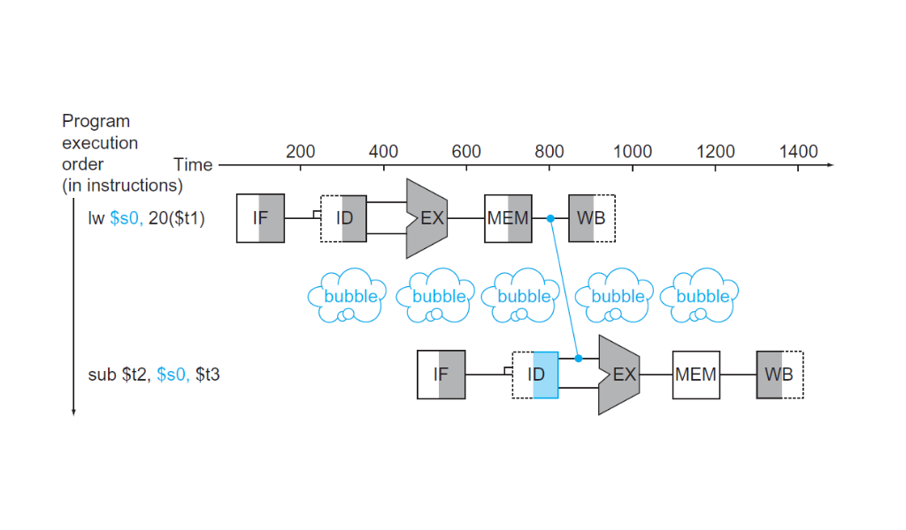

El camino de datos (*datapath*) de MIPS que vimos antes no es realista.
Existe una técnica llamada *pipelining* en el diseño de CPUs que logra un aumento considerable en rendimiento, dejando el diseño anterior como una simplificación didáctica y no mucho más.
Prácticamente todas las CPUs modernas usan la técnica de *pipelining* para aumentar la cantidad de instrucciones que ejecutan por unidad de tiempo.

# Contenidos
{:.no_toc}

1. Generated ToC
{:toc}

## Una analogía

La idea detrás de lo que conocemos como _pipelining_ en el diseño de CPUs debería resultarnos familiar. Es lo mismo que en una línea de montaje en una fábrica. Tenemos varios recursos que realizan una tarea y cada uno de estos recursos trabajan en paralelo intentando siempre que no haya tiempo libre en el que no se utilizan. Tal vez una analogía sirva para entenderlo mejor.

Supongamos que tenemos que lavar la ropa. Tenemos un lavarropas, un secarropas, una mesa para doblar la ropa y el ropero donde la guardamos.
Una forma de lavar la ropa sería meter una tanda en el lavarropas. Cuando termina el lavado, metemos la ropa en el secarropas. Esperamos a que termine, sacamos la ropa seca y la doblamos. Por último la guardamos en el ropero.
Hay cuatro etapas en la tarea de lavar la ropa y cada una tiene un recurso asociado.
- Lavar (el lavarropas).
- Secar (el secarropas).
- Doblar (la mesa).
- Guardar (el ropero).

Si tenemos que hacer varias tandas de lavado una forma sería realizar estas cuatro tareas secuencialmente y al terminar de guardar la primera tanda empezamos a lavar la segunda tanda.
Esta forma sería hacer el lavado sin _pipelining_.

Una forma más inteligente sería poner la primera tanda en el lavarropas. Cuando termina de lavar, poner la primera tanda en el secarropas y al mismo tiempo poner la segunda tanda en el lavarropas. Estamos suponiendo que todas las etapas del lavado llevan el mismo tiempo.
Cuando terminamos de secar la ropa de la primera tanda la doblamos, y a la vez ponemos la segunda tanda en el secarropas y la tercera en el lavarropas. Y así sucesivamente. La idea se entiende mejor con un diagrama.

{:.zoom}
*Arriba lavar la ropa de manera secuencial. Abajo lavar la ropa usando pipelining*

Este es el concepto de _pipelining_. Ejecutar varias tareas (tandas de ropa) en simultáneo, aprovechando en todo momento la totalidad de los recursos. En una CPU las tareas son instrucciones, y los recursos son las unidades funcionales del *datapath* como la ALU, el archivo de registros o la memoria de datos.

Esta analogía muestra que un lavado completo tarda lo mismo con o sin _pipelining_. Pero si miramos los diagramas de arriba, en el primero lavar cuatro tandas de ropa lleva ocho horas. Mientras que en el que realiza tareas en simultáneo lleva solo tres horas y media.

En una CPU donde el número de tareas (instrucciones) es mucho mayor al número de etapas en el _pipeline_ la versión con _pipelining_ es más rápido por un factor casi igual al número de etapas que la versión sin _pipeline_.
Por ejemplo, si una CPU con el _datapath_ como el que vimos antes ejecuta diez mil instrucciones en un segundo, la versión con un _pipeline_ de cuatro etapas ejecuta las mismas diez mil instrucciones en aproximademente un cuarto de segundo.

## Etapas del pipeline de MIPS

Las instrucciones en MIPS en general llevan cinco pasos:
1. Traer la instrucción de la memoria: **IF** (*instruction fetch*).
2. Decodificar la instrucción y leer el archivo de registros: **ID** (*instruction decode*).
3. Ejecutar una operación en la ALU: **EX** (*execute*).
4. Acceder a la memoria de datos para leer o escribir: **MEM** (*memory access*).
5. Escribir el resultado de una operación en el archivo de registros: **WB** (*write back*).

{:.zoom}
*Las etapas del pipeline de MIPS: IF, ID, EX, MEM y WB. Las líneas azules están para representar los únicos dos casos en que los datos fluyen de derecha a izquierda: en la etapa de WB y en la etapa de MEM cuando se ejecuta un branch.*

Lamentablemente no todas las etapas pueden completar su tarea en el mismo tiempo. Algunas unidades funcionales tienen mayor latencia que otras. Por ejemplo, acceder a la memoria de datos es más lento que leer o escribir en el archivo de registros. En la siguiente tabla damos valores concretos a la latencia de cada etapa. Los datos son ficticios, están solamente para hacer un poco más concreta la explicación.

|Instrucción|Traer instrucción|Leer registros|ALU|Acceso a memoria|Escribir registro|Total|
|---|---|---|---|---|---|---|
|`lw`|200ps|100ps|200ps|200ps|100ps|800ps|
|`sw`|200ps|100ps|200ps|200ps||700ps|
|Tipo R|200ps|100ps|200ps||100ps|600ps|
|`beq`|200ps|100ps|200ps|||500ps|

La instrucción `lw` como se ve en la tabla realiza trabajo en las cinco etapas. La tabla ilustra dos cosas.

La versión del *datapath* de ciclo único (la que vimos en los posts anteriores) tiene que usar un ciclo de 800ps para poder ejecutar un `lw`. Por más que un `beq` requiera 500ps solamente el ciclo de reloj tiene que ser el mismo para todas las instrucciones.

La versión con *pipeline* necesita un ciclo de reloj equivalente a la etapa de mayor duración, por lo tanto de 200ps. Parecería que estamos perdiendo con el _pipeline_ porque ahora una instrucción tarda 1000ps.

{:.zoom}
*El pipeline de MIPS de cinco etapas (abajo) comparado con el datapath simplificado que vimos en los posts anteriores (arriba).*

Pero en realidad estamos completando una instrucción cada 200ps, por lo tanto estamos haciendo el mismo trabajo 4 veces más rápido. Claro, en el diagrama que está arriba los tres _load word_ tardan 2400ps en la versión de ciclo único contra 1400ps en la versión con _pipeline_. Pero si sumamos un millón de instrucciones vemos que en la versión de ciclo único agregamos 800ps por cada instrucción mientras que con _pipelining_ agregamos 200ps por cada instrucción.

$$ \frac{800.002.400}{200.001.400} \simeq \frac{800}{200} \simeq 4 $$

Si las etapas del _pipeline_ estuvieran perfectamente balanceadas la mejora en rendimiento se acercaría bastante a cinco, el número de etapas del _pipeline_. Nunca sería exactamente igual al número de etapas porque el _pipeline_ introduce también sus complicaciones como los **riesgos**.

## Riesgos

El *pipeline* no viene sin sus desventajas. Si consideramos por ejemplo las siguientes instrucciones en MIPS:

```
add $s0, $t0, $t1
sub $t2, $s0, $t3
```

Vemos que la instrucción `sub` necesita el resultado del `add` para ejecutarse. El resultado de `add` aparece en `$s0` recién en la quinta etapa (WB) pero el `sub` necesita el valor correcto de `$s0` en su tercera etapa (EX) un ciclo de reloj antes. Esto se conoce como riesgo (*hazard*) y hay tres tipos a considerar.

### Riesgos estructurales

El primer tipo de riesgo es el estructural. No encontraremos este riesgo en el _pipeline_ de MIPS porque la gente que diseñó esta arquitectura lo hizo teniendo cuidado de no introducir riesgos estructurales.

Un ejemplo sería si en el _datapath_ de MIPS en vez de tener memorias de instrucciones y datos separadas tuviéramos una única memoria para instrucciones y datos. Lo que pasaría es que cuando un _load word_ estuviera intentando leer un dato en la memoria en la etapa de MEM, una instrucción debajo del `lw` estaría en la fase de IF tratando de leer de la misma memoria. Y las dos cosas juntas no se pueden hacer.

Si miramos con atención el diagrama del _datapath_ con las cinco fases podemos ver que hay dos etapas que comparten el archivo de registros: ID y WB. La manera de no introducir un riesgo estructural es diseñando el archivo de registros para que la escritura se produzca en la primera mitad del ciclo de reloj y la lectura en la segunda mitad. De esta manera dos instrucciones pueden estar una en la fase ID y otra en WB y usar el archivo de registros al mismo tiempo y obtener el valor deseado.

### Riesgos de datos

El tipo de riesgo más frecuente en un _pipeline_ es el de datos. El riesgo de datos es cuando tenemos una instrucción que escribe un registro y este registro lo usan instrucciones posteriores, como en el ejemplo que abre esta sección.

Los riesgos de datos pueden a veces ser resueltos en parte por _software_. Por ejemplo, el compilador puede intentar reordenar el código para evitar dependencias de datos entre instrucciones consecutivas. Pero cuando no se pueden resolver es responsabilidad del _hardware_ asegurar que los resultados de un programa sean los correctos.

La manera más sencilla y eficiente de resolver los riesgos de datos es usando lo que se conoce como _forwarding_. Agregando _hardware_ extra a la CPU podemos pasar el resultado de la ALU al final de la etapa de EX a la entrada de la ALU para la próxima instrucción.

{:.zoom}
*Una manera de salvar los riesgos de datos es usando forwarding. El resultado del `add` es pasado a la etapa de EX del `sub` mucho antes de la fase de WB.*

Esta solución solo puede aplicarse siempre que la etapa de destino sea posterior a la etapa de origen del valor que pasamos hacia adelante. En el diagrama de arriba el _forwarding_ se produce del ciclo 3 al ciclo 4. Si la primera instrucción fuera en vez del `add` un `lw $s0, 20($t1)` no habría _forwarding_ posible, porque no podemos volver atrás en el tiempo.

En esos casos la única manera de salvar la dificultad sería parando el _pipeline_ por un ciclo de reloj, lo que se conoce como _pipeline stall_ o _bubble_ (burbuja) haciendo una analogía con introducir una burbuja de aire en la tubería que retrasa el flujo de agua.

{:.zoom}
*Una burbuja es una operación que no hace nada en el pipeline. Una instrucción que no hace nada se llama nop (no operation). Insertando la burbuja en el pipeline ganamos tiempo para tener el resultado correcto del `lw` para pasar al `sub`.*

Noten que en el diagrama del _datapath_ con las fases las líneas en azul que corresponden a un movimiento de datos de derecha a izquierda, la línea de datos de la fase de WB da lugar a riesgos de datos. La línea azul que corresponde a la fase de MEM con la dirección del PC después de un _branch_ verdadero da lugar a riesgos de control.

### Riesgos de control

Los riesgos de control corresponden a las instrucciones de _branch_ como `beq`. El problema con los _branchs_ es que el resultado de comparar dos registros recién está disponible en la cuarta fase (MEM) y ya tenemos tres instrucciones más en el _pipeline_ que no sabemos si son las correctas. Pongamos código de ejemplo:

```
loop:
  beq     $zero, $t0, exit
  li      $v0, 1
  li      $a0, 1
  syscall
  addi    $t0, $t0, -1
exit:
  li      $v0, 10
  syscall
```

Cuando el `beq` entra al _pipeline_ a la fase IF no sabemos aún si hay que seguir la ejecución del programa en el `li $v0, 1` o en el `li $v0, 10` (en `exit`). Pero en el próximo ciclo de reloj entra en la fase de IF el `li $v0, 1` (`beq` ahora está en ID). Luego entra en IF el `li $a0, 1` y `beq` está en EX. Por último entra `syscall` al _pipeline_ y `beq` ahora sí está en MEM. Ya sabemos si el _branch_ es verdadero o no, pero introdujimos 3 instrucciones al _pipeline_ cuando en realidad existe la posibilidad de que la instrucción que tenía que seguir a `beq` era el `li $v0, 10` después de la etiqueta `exit`.

Una opción en estos casos es insertar burbujas hasta tener el resultado del _branch_. La opción más utilizada sin embargo es predecir el resultado de la comparación. El _hardware_ utilizado para intentar predecir el resultado de un _branch_ ha mejorado (y se ha complejizado) mucho con los años y hoy en día se puede predecir con un 90% de precisión. Si la predicción es incorrecta se produce una perdida de tiempo (ciclos de reloj) en la CPU, pero si es correcta el _pipeline_ avanza a toda velocidad.

## Datapath y control para el pipeline de MIPS

Entonces, ¿cuál es la diferencia, en _hardware_, entre el _datapath_ de ciclo único y un _pipeline_?
Para poder separar una instrucción en fases y ejecutar varias de manera simultánea en el mismo camino de datos usamos registros que separen cada fase.

{:.zoom}
*Los registros del pipeline separando cada fase. Por ejemplo el registro IF/ID tiene 64 bits de ancho, 32 para el valor del PC y 32 para la instrucción.*

Esto es necesario porque si en un mismo ciclo de reloj tenemos una instrucción en la etapa de IF y otra en ID los buses que llevan los bits de la instrucción no pueden ser compartidos por instrucciones diferentes. Consideraciones similares aplican a cada par de etapas del _pipeline_. La única excepción es el pasaje entre la quinta etapa y la primera porque el registro que contiene la entrada para la fase de IF es el PC, y la etapa de WB no actualiza el PC.

Cada uno de estos registros debe tener el ancho suficiente para almacenar la información que es salida de una etapa y entrada de otra. Además si hay información producida en una etapa que se necesita en una fase más adelante también hay que pasarla por las etapas intermedias.

- En el registro IF/ID la salida de IF es el PC (por si es necesario en un _branch_) y la instrucción. Son 64 bits en total y forman la entrada para la fase de ID.
El valor del PC se necesita en la fase de EX si la instrucción es un _branch_, no en ID, pero hay que pasarlo por las etapas intermedias.
- El registro ID/EX tiene 128 bits de ancho. Son dos registros y la constante extendida a 32 bits. Dos de esos tres valores serán los operandos de la ALU. Además seguimos pasando el valor del PC hacia adelante para la fase de EX.
- El registro EX/MEM recibe el resultado de la ALU, el _flag_ Zero de la ALU, la dirección calculada para un _branch_ y el registro para escribir a la memoria de datos en el caso de un `sw`. En total son 97 bits.
- El registro MEM/WB tiene 64 bits de ancho. 32 por el resultado de la ALU y 32 por la palabra leída de la memoria de datos como es el caso de un `lw`.

De la misma manera que los datos se mueven a través del _pipeline_ pasando por los registros para no perder información en cada ciclo de reloj, también hay que pasar las señales de control a cada etapa del _pipeline_.
Las señales de control se generan en la fase ID (los 6 bits del _opcode_ entran a la unidad de control).
Por lo tanto en el registro IF/ID no hay señales de control, recién en ID/EX ampliamos el registro para guardar las señales que son las mismas que vimos en el _datapath_ de ciclo único.

{:.zoom}
*Este diagrama muestra que usamos los mismos registros del pipeline para pasar señales de control. Separamos las señales según la fase que las necesite. Por ejemplo la señal ALUSrc se usa en la fase EX y no pasa hacia MEM y WB.*

El control del camino de datos con _pipeline_ no cambia demasiado. Si generamos todas las señales de control en la fase de _instruction decode_ y las pasamos hacia adelante en el _pipeline_ usando los registros todo lo demás es exactamente igual al _datapath_ de ciclo único.

{:.zoom}
*Datapath con pipeline para un subconjunto de instrucciones de MIPS. La única diferencia son los 4 registros que separan las fases. En azul las líneas de control.*

El último diagrama no tiene en cuenta el problema de los riesgos que explicamos en la sección anterior. Este camino de datos solo puede manejar secuencias de instrucciones sin dependencias de datos entre instrucciones o _branchs_.

Para poder manejar riesgos, que existen en prácticamente cualquier programa que pueda ejecutar la CPU, hay que agregar _hardware_ como una unidad de detección de riesgos para insertar burbujas, o una unidad de _forwarding_.
