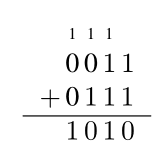
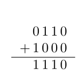

Un resumen de los sistemas de numeración usados en computación y sus aplicaciones para la representación de la información.

# Contenidos
{:.no_toc}

1. Generated ToC
{:toc}  

## Sistemas de numeración posicionales

Un sistema de numeración posicional es un sistema que utiliza una base $b$ que determina la cantidad de símbolos del sistema, con $b \in \mathbb{N}$ y $b > 1$.
Por ejemplo en el sistema decimal $b = 10$ y los símbolos del sistema son $\\{0,1,2,3,4,5,6,7,8,9\\}$. Cualquier número natural $N$ en un sistema de numeración posicional puede expresarse como

$$ N = \sum_{i=0}^{n-1} d_ib^i $$

donde $d$ es un dígito o símbolo de los permitidos por el sistema.
Por ejemplo en base 10 o decimal el número $1234$ es

$$1234_{10} = 1\cdot 10^3 + 2\cdot 10^2 + 3\cdot 10^1 + 4\cdot 10^0$$

Pero en base 16 o hexadecimal el número $1234$ equivale a

$$ 1234_{16} = 1\cdot 16^3 + 2\cdot 16^2 + 3\cdot 16^1 + 4\cdot 16^0 = 4660_{10}$$

## Binario

Por sus ventajas técnicas a la hora de construir computadoras la gran mayoría de las computadoras que han existido desde el siglo pasado son aparatos electrónicos digitales. Es decir que trabajan con señales eléctricas con dos niveles bien diferenciados: alto y bajo o 0 y 1.

Ya que los circuitos en las computadoras trabajan exclusivamente con números y con señales digitales la representación lógica para dichos números es el sistema binario o en base dos.

Los símbolos permitidos en binario son $\\{0,1\\}$ y por lo tanto cualquier número en binario es una suma sucesiva de potencias de dos.

Ejemplos:

$$255 = 128 + 64 + 32 + 16 + 8 + 4 + 2 + 1 = 1111\ 1111_2$$

$$17 = 16 + 1 = 0001\ 0001_2$$

$$62 = 32 + 16 + 8 + 4 + 2 = 0011\ 1110_2$$

La costumbre es usar una longitud fija de dígitos en binario, aunque haya ceros a la izquierda. En los ejemplos de arriba uso números de 8 bits (_binary digits_). También se suele dejar espacios cada 4 bits para ayudar a la lectura. Es fácil perderse entre los ceros y unos.

Dada una cantidad $n$ de bits podemos representar siempre $2^n$ números distintos en el rango de $[0,2^n-1]$. Por ejemplo para 8 bits tenemos 256 combinaciones posibles, desde $0000\ 0000_2 = 0 $ hasta $1111\ 1111_2 = 255$

### Complemento a dos

Para representar números negativos en binario podemos hacer lo mismo que en decimal poniendo un menos adelante. Eso me sirve una hoja de papel pero en un circuito electrónico como una computadora me introduce un problema porque ahora necesito tres símbolos: el cero, el uno y el menos. Habíamos dicho que las señales digitales que usan las computadoras tienen dos estados bien diferenciados, conviene encontrar una representación de los números negativos que use solamente el cero y el uno.

Hubo varias propuestas a lo largo de los años pero por lejos la más utilizada hoy para los números enteros es usar el complemento a dos de un entero positivo para representar a su contraparte negativa. Por ejemplo $0001_2$ y $1111_2$ donde $1111$ es el complemento a dos de $0001$, es decir $1111_2 = -1$.

En primer lugar hay que destacar que siempre con $n$ bits hay $2^n$ combinaciones posibles. Pero ahora la mitad de esas combinaciones son números positivos y la otra mitad negativos. En los positivos incluímos al cero.

Dejo la tabla de los números positivos y negativos posibles usando 4 bits.

| Decimal  | Binario |
|:--------:|:-------:|   
| 0        | 0000    |         
| 1        | 0001    |         
| 2        | 0010    |         
| 3        | 0011    |         
| 4        | 0100    |         
| 5        | 0101    |         
| 6        | 0110    |         
| 7        | 0111    |         
| -8       | 1000    |         
| -7       | 1001    |         
| -6       | 1010    |         
| -5       | 1011    |         
| -4       | 1100    |         
| -3       | 1101    |         
| -2       | 1110    |         
| -1       | 1111    |         

El cálculo del complemento a dos es sencillo. Consiste en invertir los bits y sumar uno. Por ejemplo para el $0011=3$ el complemento a dos es $-3=1100+0001 = 1101$

Hay que tener en cuenta que si nos interesan los números positivos únicamente podríamos representar el $8$ como $1000$ pero si estamos representando también negativos $1000$ pasa a querer decir $-8$.

### Suma y resta en binario

Para sumar en binario lo hacemos de la misma manera que en decimal teniendo en cuenta que $1+1 = 10$ o en otras palabras uno más uno es cero y me llevo uno.
Por ejemplo

{:.zoom}

Para la resta lo que hacemos es sumar el complemento a dos, porque $A-B=A+(-B)$, por ejemplo $6 - 8$ en binario quedaría como

{:.zoom}

Donde $1000_2$ no es el número $8$ sino $-8$ y $1110_2$ es el complemento a dos del número $0010$, es decir $-2$.

### Operaciones lógicas

Para los números binarios podemos definir una serie de operaciones lógicas bit a bit, llamadas también operaciones _bitwise_. Estas operaciones provienen del álgebra de Boole o de la lógica y las más usadas son AND, OR, NOT y XOR. También podemos incluir en esta categoría los _shifts_ o desplazamientos.

Dado un número en binario $A$ definimos NOT $A$ o $\bar A$ como la operación que invierte los bits de $A$. Es decir, cambiamos ceros por unos y unos por ceros. Ejemplos:

$$ \overline{1110\ 0101} = 0001\ 1010 $$

$$ \overline{1111} = 0000 $$

Definimos $A$ AND $B$ o $A \cdot B$ o $AB$ como la operación entre dos números $A$ y $B$ donde el resultado es uno si y sólo si ambos bits son uno.
Ejemplos:

$$ 1001 \cdot 0001 = 0001 $$

$$ 1011 \cdot 1111 = 1011 $$

Definimos $A$ OR $B$ o $A + B$ como la operación entre dos números $A$ y $B$ donde el resultado es uno si al menos un bit es uno.
Ejemplos:

$$ 1001 + 0001 = 1001 $$

$$ 1011 + 1111 = 1111 $$

Definimos $A$ XOR $B$ o $A \oplus B$ como la operación entre dos números $A$ y $B$ donde el resultado es uno si los bits de $A$ y $B$ son distintos.
Ejemplos:

$$ 1001 \oplus 0001 = 1000 $$

$$ 1011 \oplus 1111 = 0100 $$

Una aclaración necesaria sobre la notación. Es fácil confundir la suma y multiplicación aritmética de todos los días con la operación AND y OR. A veces el contexto alcanza para distinguir entre una y otra. En otros casos se usa el _ampersand_ `&` para indicar la operación AND y el _pipe_ `|` para el OR. De hecho esa es la notación que adoptan muchos lenguajes de programación. El NOT suele indicarse con `!` y el XOR con `^`.

## Octal y hexadecimal

Como dijimos la base 2 es la elección natural para representar números en una computadora. Pero a menudo trabajamos con números binarios de 8, 16, 32, 64 bits o más. El sistema octal (base 8) y el hexadecimal (base 16) son muy útiles a la hora de trabajar con datos en binario para nosotros los humanos porque nos permiten una representación más corta de largas cadenas de bits.

El motivo de esto es que estas bases son potencias de dos y eso nos permite una conversión muy sencilla entre binario y estos sistemas.
Para pasar de binario a hexadecimal simplemente agrupamos cada 4 bits y reemplazamos por el dígito correspondiente en hexadecimal.
Ejemplos:

$$ \overbrace{1001}^{9}\ \overbrace{1100}^{\text{C}} $$

$$ 0111\ 1101_2 = 7\text{D}_{16} $$

$$ 1111\ 1000\ 1100_2 = \text{F}8\text{C}_{16} $$

Para el octal procedemos de manera similar pero agrupando cada 3 bits.

$$ \overbrace{011}^{3}\ \overbrace{111}^{\text{7}}\ \overbrace{110}^{\text{6}} $$

$$ 0111\ 1101_2 = 175_{8} $$

$$ 1111\ 1000\ 1100_2 = 7614_{8} $$

De la misma manera podemos pasar de hexadecimal u octal a binario, expandiendo cada dígito en su representación en binario ya sea en 4 o 3 bits según corresponda.

Lo más común es encontrarnos con hexadecimal, por ejemplo, al representar colores en CSS como #FF0000. Mucho más cómodo que escribir 1111 1111 0000 0000 0000 0000 que son los 24 bits que representan el color rojo. Pero en el fondo lo que existe en los circuitos son señales digitales, unos y ceros.

## Ejercicios

1. Definir _bit_, _nibble_, _byte_, _word_, LSB, MSB y _endianness_.
2. Dar una tabla con los números del 0 al 15 en decimal, binario y hexadecimal.
3. Pasar a decimal los siguientes números:
- $327_8$
- $10010110_2$
- $\text{FDA}2_{16}$
- $101100000110_2$
4. Pasar a octal y hexadecimal:
  - $110$
  - $11101$
  - $110011$
  - $11101000$
  - $10011010$
5. Pasar los siguientes colores en hexadecimal a `rgb(r, g, b)` donde `r`, `g` y `b` son números del 0 al 255:
 - #AD8799
 - #EE810F
 - #FCD777
6. Dar el complemento a dos de los números del ejercicio 4.
7. Dados $A = 1011\ 0111$, $B = 0111\ 1011$ y $C = 0010\ 0101$ resolver:
  - $A\ \text{OR}\ B$
  - $A + B$
  - $\overline{A\ \text{AND}\ B}$
  - $(B + C)\ \text{XOR}\ A $
  - $A \oplus A$
  - $CA + B$
  - $B\ \text{OR}\ \overline{B}$
